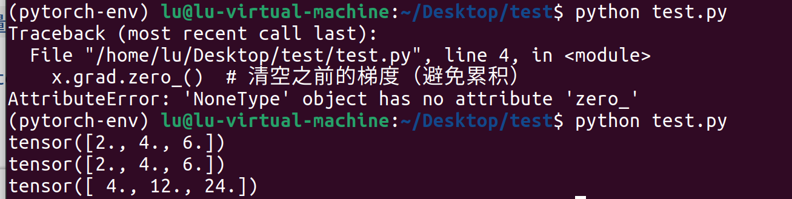
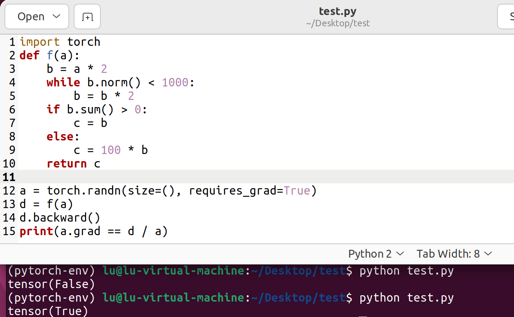

# DAY 5
教程:
https://zh-v2.d2l.ai/ 
https://www.runoob.com/python/python-tutorial.html

### 完成任务
预备知识中的自动微分和概率部分（自动微分部分有点难理解嘞，边看边让AI从好几个角度又解释了一遍）（见Pytorch_learning1.py）
   
### 遇到的问题
1. 在调用 x.grad.zero_() 时，x.grad 还是 None（尚未初始化），而 None 没有 zero_() 方法。教程中代码是基于前面的，所以要调用 x.grad.zero_()清除前面的梯度，而我这是又新建了一个，所以删去x.grad.zero_()该行代码即可。
   
2. 代码逻辑本身是对的，但由于 torch.randn 生成的是随机值，可能某次运行的 a 使得 f(a) 的分段逻辑导致 d / a 与梯度的数值存在微小差异（或因浮点精度问题），从而输出 tensor(False)。
   
   可添加一行`torch.manual_seed(0)`固定随机种子，确保结果可复现。不过也就第一此运行出现tensor(False)，后面几次运行都是tensor(True)