# Pytorch学习
## 教程
李沐老师的《动手学深度学习》：https://www.bilibili.com/video/BV1f54ZzGEMC/?spm_id_from=333.337.search-card.all.click&vd_source=301feeee8ee482b3882c9f098e564491
### 资源
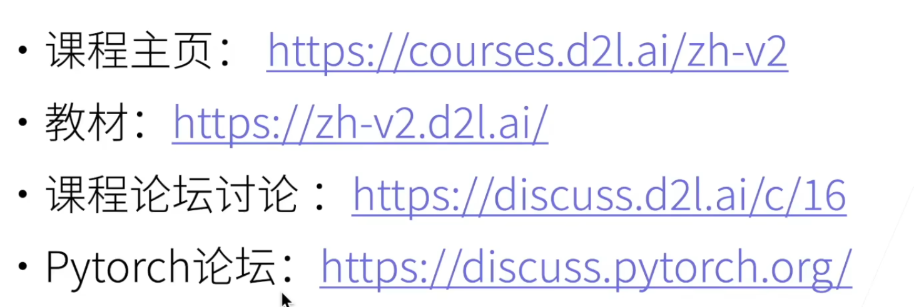
https://github.com/d2l-ai
学习内容见：https://zh-v2.d2l.ai/ 
以课件学习为主，视频学习为辅。

### 知识点
#### 预备知识

1. 张量(tensor) ： 表示一个由数值组成的数组，这个数组可能有多个维度。张量中的每个值都称为张量的 元素（element）。新的张量将存储在内存中，并采用基于CPU的计算。
   深度学习存储和操作数据的主要接口
   需导入torch
    ```import torch```
    ```
    x = torch.arange(12)        # arange 创建一个行向量 x
    x
    > tensor([ 0,  1,  2,  3,  4,  5,  6,  7,  8,  9, 10, 11])

    x.shape                     # shape属性来访问张量（沿每个轴的长度）的形状 
    > torch.Size([12])

    x.numel()                   # 张量中元素的总数，即形状的所有元素乘积
    > 12

    X = x.reshape(3, 4)         # 改变一个张量的形状而不改变元素数量和元素值
    X      
    >  tensor([[ 0,  1,  2,  3],
               [ 4,  5,  6,  7],
               [ 8,  9, 10, 11]])   
    # 不需要通过手动指定每个维度来改变形状。指定其中的n-1个维度，剩下一个维度可用-1代替，如上面的例子可用x.reshape(-1,4)或x.reshape(3,-1)
    torch.zeros((2, 3, 4))      # 其中所有元素都设置为0
    torch.ones((2, 3, 4))       # 其中所有元素都设置为0
    # （2，3，4）三维，可以看到有三个方括号
    > tensor([[[1., 1., 1., 1.],
               [1., 1., 1., 1.],
               [1., 1., 1., 1.]],

              [[1., 1., 1., 1.],
               [1., 1., 1., 1.],
               [1., 1., 1., 1.]]]) 
    torch.randn(3, 4)           # 其中的每个元素都从均值为0、标准差为1的标准高斯分布（正态分布）中随机采样
    > tensor([[-0.0135,  0.0665,  0.0912,  0.3212],
              [ 1.4653,  0.1843, -1.6995, -0.3036],
              [ 1.7646,  1.0450,  0.2457, -0.7732]])
    
    #直接赋值
    torch.tensor([[2, 1, 4, 3], [1, 2, 3, 4], [4, 3, 2, 1]])
    > tensor([[2, 1, 4, 3],
              [1, 2, 3, 4],
              [4, 3, 2, 1]])
    
    B = A.clone()  # 通过分配新内存，将A的一个副本分配给B
    ```
    ```
    # 张量形状相同
    # 标准算术运算符
    x = torch.tensor([1.0, 2, 4, 8])
    y = torch.tensor([2, 2, 2, 2])
    x + y, x - y, x * y, x / y, x ** y  # **运算符是求幂运算
    > (tensor([ 3.,  4.,  6., 10.]),
       tensor([-1.,  0.,  2.,  6.]),
       tensor([ 2.,  4.,  8., 16.]),
       tensor([0.5000, 1.0000, 2.0000, 4.0000]),
       tensor([ 1.,  4., 16., 64.]))
    
    # 把多个张量连结（concatenate）在一起
    X = torch.arange(12, dtype=torch.float32).reshape((3,4)) # 浮点型，3 X 4
    Y = torch.tensor([[2.0, 1, 4, 3], [1, 2, 3, 4], [4, 3, 2, 1]])
    torch.cat((X, Y), dim=0)            #沿行
    torch.cat((X, Y), dim=1)            #沿列
    > (tensor([[ 0.,  1.,  2.,  3.],
               [ 4.,  5.,  6.,  7.],
               [ 8.,  9., 10., 11.],
               [ 2.,  1.,  4.,  3.],
               [ 1.,  2.,  3.,  4.],
               [ 4.,  3.,  2.,  1.]]),
       tensor([[ 0.,  1.,  2.,  3.,  2.,  1.,  4.,  3.],
               [ 4.,  5.,  6.,  7.,  1.,  2.,  3.,  4.],
               [ 8.,  9., 10., 11.,  4.,  3.,  2.,  1.]]))

    # 逻辑运算符
    # 对于每个位置，如果X和Y在该位置相等，则新张量中相应项的值为1。 这意味着逻辑语句X == Y在该位置处为真，否则该位置为0。
    X == Y                              # X和Y维度形状相同
    > tensor([[False,  True, False,  True],
              [False, False, False, False],
              [False, False, False, False]])

    X.sum()                             # 对张量中的所有元素进行求和
    > tensor(66.)
    ```
    
    广播机制（broadcasting mechanism）
    1. 通过适当复制元素来扩展一个或两个数组，以便在转换之后，两个张量具有相同的形状；
    2. 对生成的数组执行按元素操作。
    ```
    # 张量形状不同
    a = torch.arange(3).reshape((3, 1))
    b = torch.arange(2).reshape((1, 2))
    a, b
    a + b
    (tensor([[0],
             [1],
             [2]]),
     tensor([[0, 1]]))
     tensor([[0, 1],
             [1, 2],
             [2, 3]])
    # 将两个矩阵广播为一个更大的 3 X 2矩阵，矩阵a将复制列， 矩阵b将复制行，然后再按元素相加
    ```
    索引和切片
    索引访问张量中的元素
    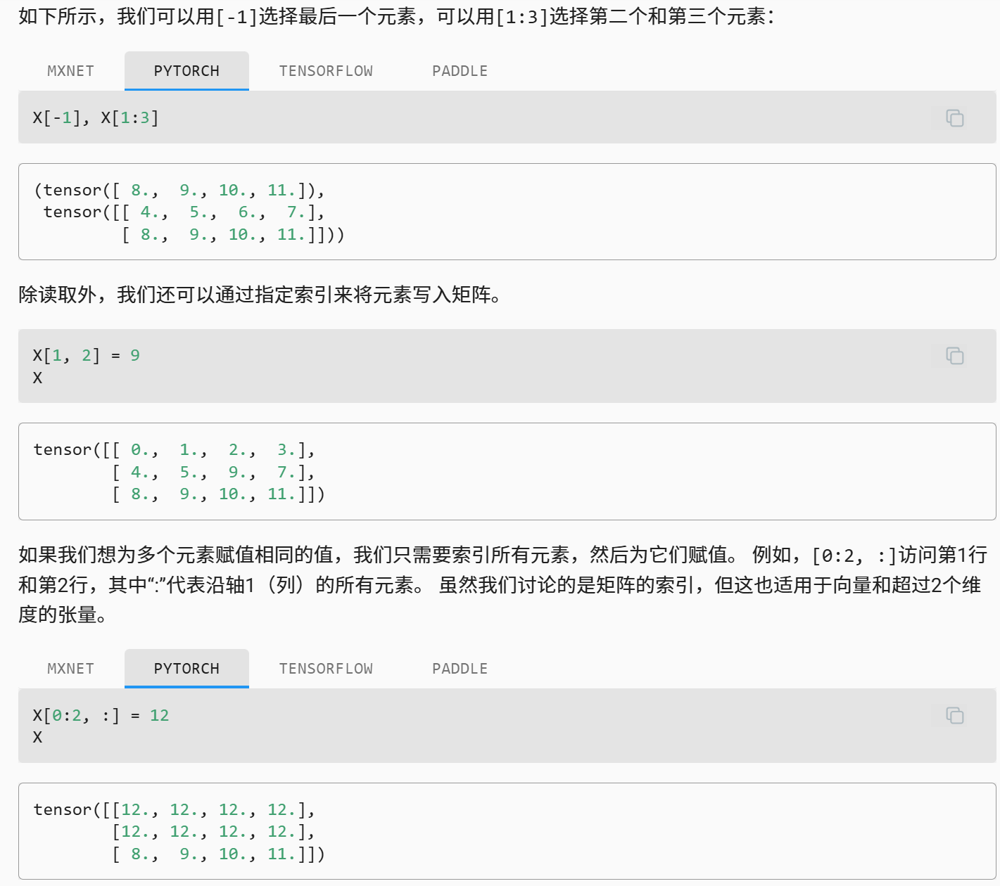
    节省内存
    ```
    # 使用切片表示法将操作的结果分配给先前分配的数组
    X[:] = <expression>
    X[:] = X + Y 或 X += Y
    ```

    转换为其他Python对象
    ```
    # NumPy张量（ndarray）转换为张量
    A = X.numpy()
    B = torch.tensor(A)
    type(A), type(B)
    > (numpy.ndarray, torch.Tensor)

    # 大小为1的张量转换为Python标量
    a = torch.tensor([3.5])
    a, a.item(), float(a), int(a)
    > (tensor([3.5000]), 3.5, 3.5, 3)
    ```
    练习
    1. 将本节中的条件语句X == Y更改为X < Y或X > Y，然后看看你可以得到什么样的张量。
    2. 用其他形状（例如三维张量）替换广播机制中按元素操作的两个张量。结果是否与预期相同？
    **广播机制中的两个张量，要能通过复制整个行或列拓展为形状相同的张量。如形状为3 X 4和4 X 3的两个张量就不能通过广播机制来进行运算。** 
    代码见code/practice1.py
    结果：
    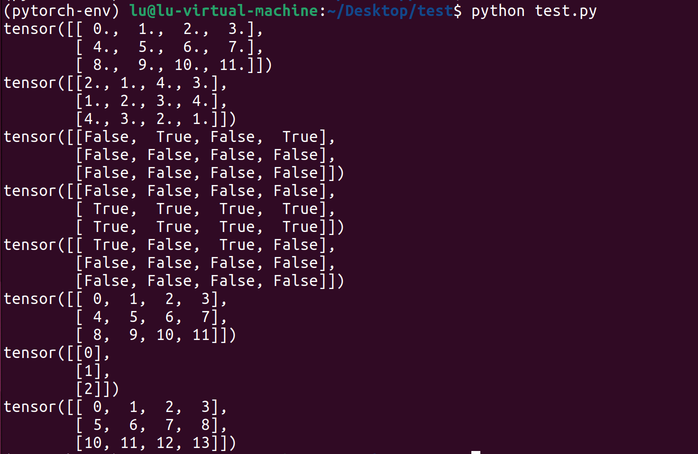
2. 数据预处理
   使用pandas预处理原始数据，并将原始数据转换为张量格式的步骤。
   1. 读取数据集
        ```
        # 导入pandas包并调用read_csv函数
        import os
        import pandas as pd

        os.makedirs(os.path.join('..', 'data'), exist_ok=True)
        data_file = os.path.join('..', 'data', 'house_tiny.csv')
        with open(data_file, 'w') as f:
            f.write('NumRooms,Alley,Price\n')  # 列名
            f.write('NA,Pave,127500\n')  # 每行表示一个数据样本
            f.write('2,NA,106000\n')
            f.write('4,NA,178100\n')
            f.write('NA,NA,140000\n')
        data = pd.read_csv(data_file)
        print(data)
        >    NumRooms Alley   Price
         0       NaN  Pave  127500
         1       2.0   NaN  106000
         2       4.0   NaN  178100
         3       NaN   NaN  140000
        ```
    1. 处理缺失值 NaN
        插值法用一个替代值弥补缺失值
        ```
        inputs, outputs = data.iloc[:, 0:2], data.iloc[:, 2]
        # 处理 NumRooms离散值，用均值填充
        inputs = inputs.fillna(inputs.mean())               
        # 处理Alley类型值，转换成两列
        inputs = pd.get_dummies(inputs, dummy_na=True)
        print(inputs)
        >         NumRooms  Alley_Pave  Alley_nan
            0       3.0           1          0
            1       2.0           0          1
            2       4.0           0          1
            3       3.0           0          1
        ```
        运行inputs = inputs.fillna(inputs.mean())时，因无法处理Alley类型，会报错
            

    3. 转换为张量格式
        ```
        import torch

        x = torch.tensor(inputs.to_numpy(dtype=float))
        y = torch.tensor(outputs.to_numpy(dtype=float))
        print(x)
        print(y)
        (tensor([[3., 1., 0.],
                 [2., 0., 1.],
                 [4., 0., 1.],
                 [3., 0., 1.]], dtype=torch.float64),
         tensor([127500., 106000., 178100., 140000.], dtype=torch.float64))
         ```
    4. 练习
        创建包含更多行和列的原始数据集。
       1. 删除缺失值最多的列。
       2. 将预处理后的数据集转换为张量格式。
       代码见code/practice2.py
        结果：
        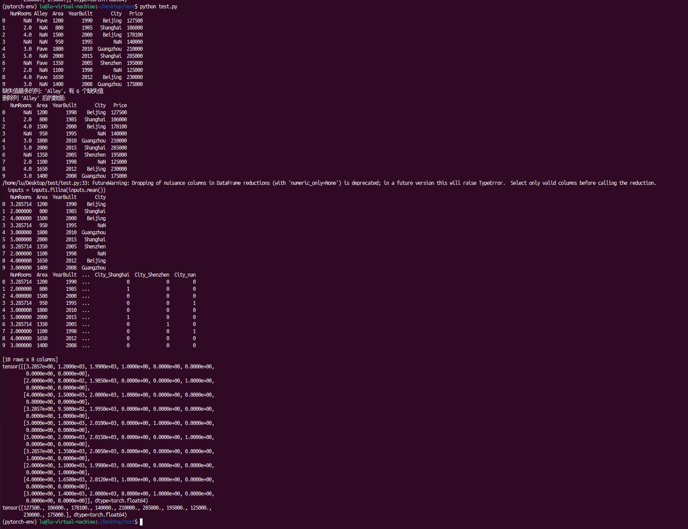
3. 线性代数
   1. 标量（scalar）、向量
   2. 长度、维度和形状
        ```
        len(x)      # 长度
                    # 维度看有几行
        x.shape     # 形状
        ```
    3. 矩阵
        ```
        A.T             # 矩阵的转置
        ```
    4. 张量算法的基本性质
       1. 两个相同形状的张量相加或相乘，对应元素相加或相乘（Hadamard积）
       2. 张量乘以或加上一个标量不会改变张量的形状，其中张量的每个元素都将与标量相加或相乘。
    5. 降维
        ```
        A_sum_axis0 = A.sum(axis=0)     # 通过求和所有行的元素来降维（轴0）
        A_sum_axis1 = A.sum(axis=1)     # 通过求和所有列的元素来降维（轴1）
        A.sum(axis=[0, 1])或A.sum()     # 求和
        A.mean()或 A.sum() / A.numel()  # 求平均值
        # 沿指定轴降低张量的维度
        A.mean(axis=0)或A.sum(axis=0) / A.shape[0]
        ```
    6. 不降维
        ```
        sum_A = A.sum(axis=1, keepdims=True)    # 计算总和或均值时保持轴数不变
        A.cumsum(axis=0)                        # 沿某个轴计算A元素的累积总和,不会沿任何轴降低输入张量的维度。
        ```
    7. 乘
        ```
        torch.dot(A,B) 或 torch.sum(A * B)     # 点积（Dot Product）
        torch.mv(A, B)                          # 向量积，A的列维数（沿轴1的长度）必须与B的维数（其长度）相同
        torch.mm(A, B)                          # 矩阵-矩阵乘法（matrix-matrix multiplication
        ``` 
    8. 范数（norm）
        向量的范数是表示一个向量有多大。
        |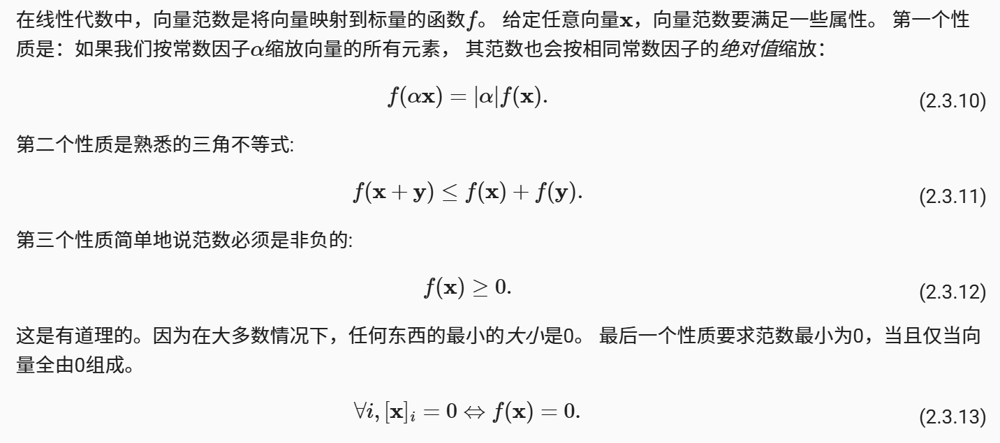|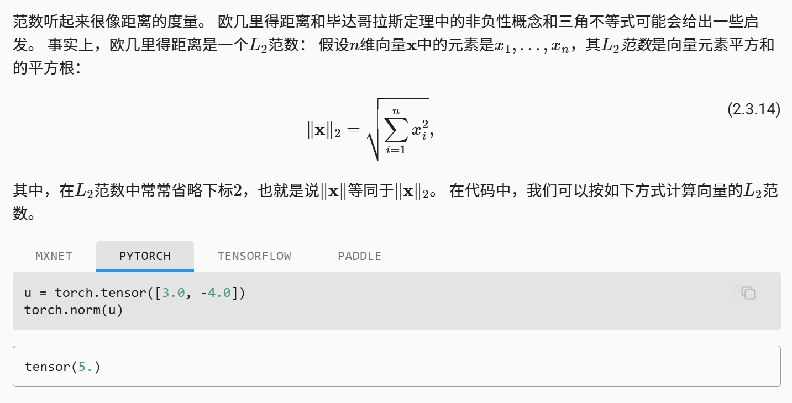|
        |--|--|
        |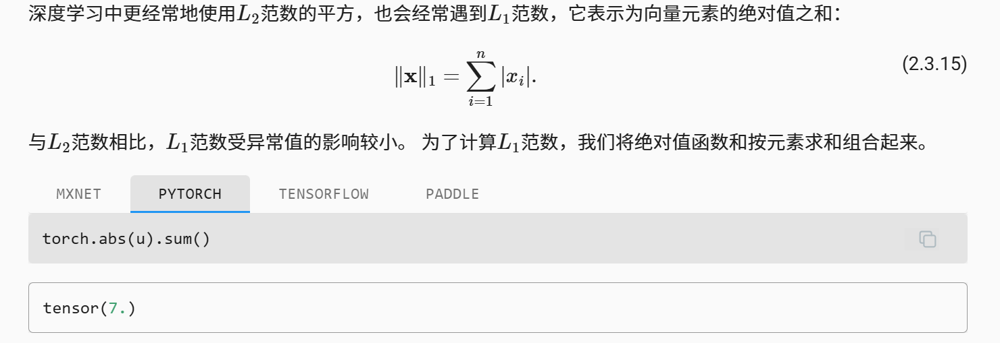|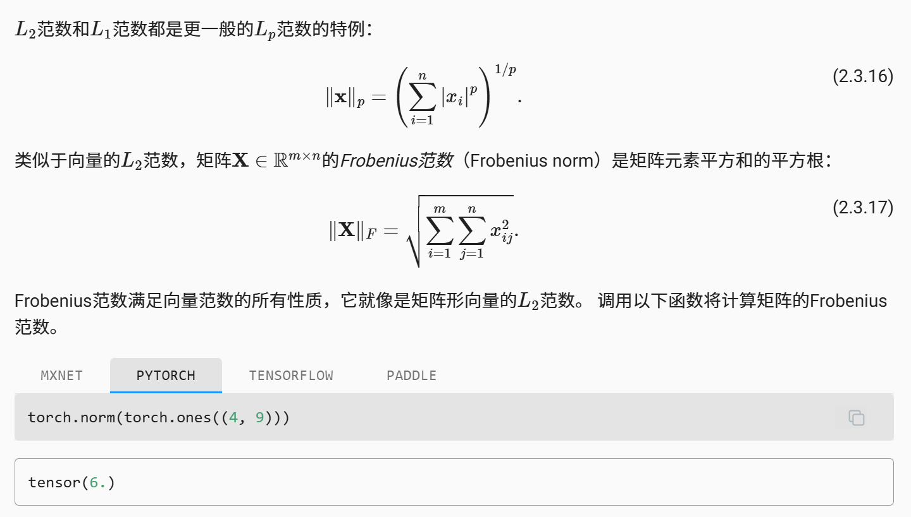|

        目标，或许是深度学习算法最重要的组成部分（除了数据），通常被表达为范数。
    9. 练习
        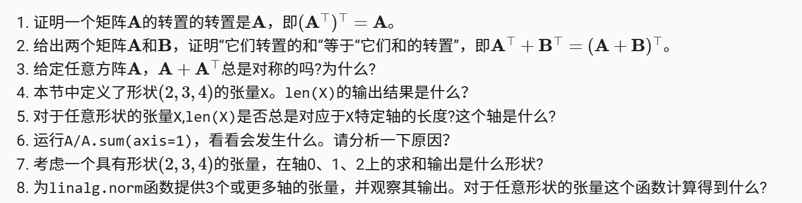
        代码见code/practice3.py
        结果：
        ||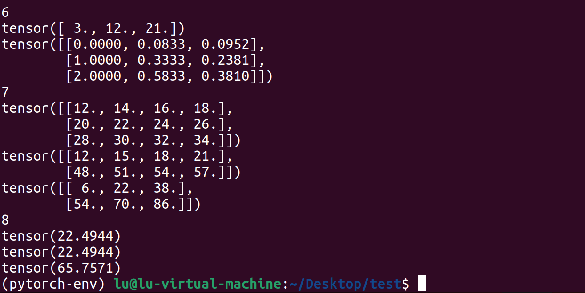|
        |--|--|
1. 微积分
   基础的求导微分知识已学过
   1. 导数、积分和偏导数
   代码见code/test4.py , 因为直接看没看懂，所以让AI给加了点注释
   1. 梯度
    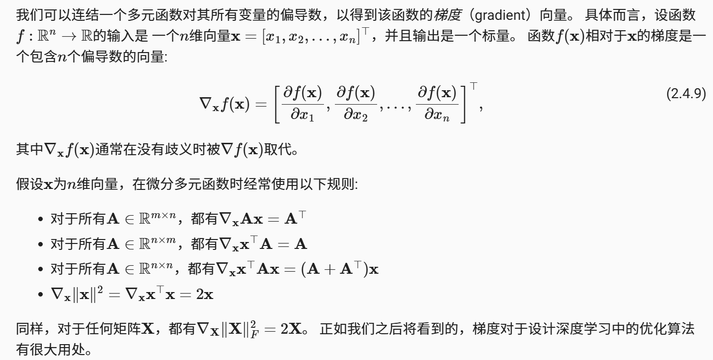
    1. 链式法则
    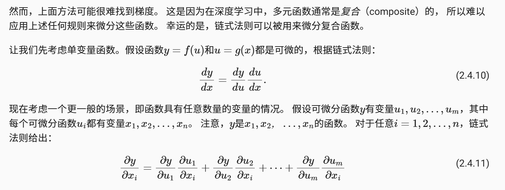
    1. 练习
     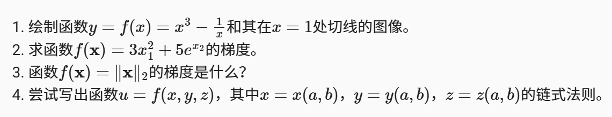
     答案：

        |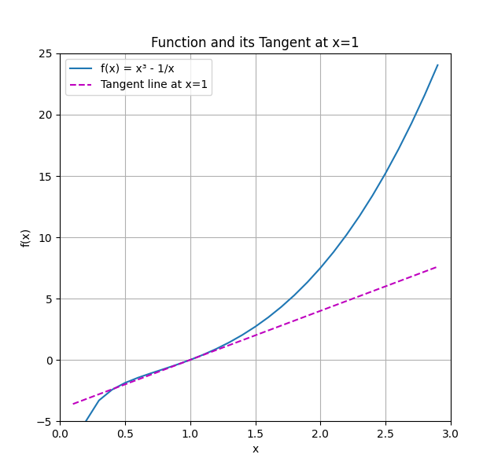|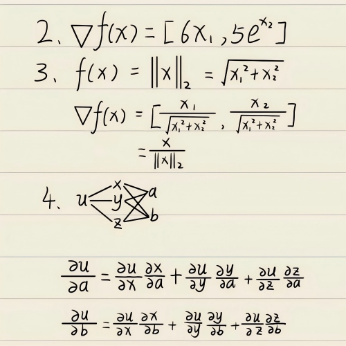|
        |--|--|
1. 自动微分(autograd)
   > 好像是计划中下周的内容？？哈哈，进度比自己想的快

   目标：在复杂的模型，手工进行更新痛苦且经常容易出错的问题。
   机制：深度学习框架通过自动计算导数，即自动微分（automatic        differentiation）来加快求导。 实际中，根据设计好的模型，系统会构建一个计算图（computational graph）， 来跟踪计算是哪些数据通过哪些操作组合起来产生输出。 自动微分使系统能够随后反向传播梯度。 这里，反向传播（backpropagate）意味着跟踪整个计算图，填充关于每个参数的偏导数。
   **一个小例子：**
    ```
    x = torch.arange(4.0)
    # 为张量开启自动求导功能，并提示此时梯度尚未计算（为 None）
    x.requires_grad_(True)  # 等价于x=torch.arange(4.0,requires_grad=True),requires_grad=True用于开启自动求导追踪
    print(x.grad)           # 用于访问张量 x 的梯度值,默认值是None
    y = 2 * torch.dot(x, x) # y=2 * x^T * x
    print(y)
    y.backward()            # 调用反向传播函数来自动计算y关于x每个分量的梯度

    # 在默认情况下，PyTorch会累积梯度，故计算x的另一个函数前我们需要清除之前的值
    x.grad.zero_()
    ```
    1. 非标量变量的反向传播
        非标量张量调用backward()需要传入gradient参数
        1. 若 y 是标量（如 y = x.sum()），直接调用 y.backward() 即可，PyTorch 会自动计算 y 对所有依赖的张量（如 x）的梯度。
        2. 若 y 是非标量（如 y = x * x，形状与 x 相同），直接调用 y.backward() 会报错，因为 “非标量对张量的梯度” 是一个矩阵（雅可比矩阵），PyTorch 无法直接计算，需要通过 “梯度参数” 指定如何将其转化为标量的梯度。
    
        |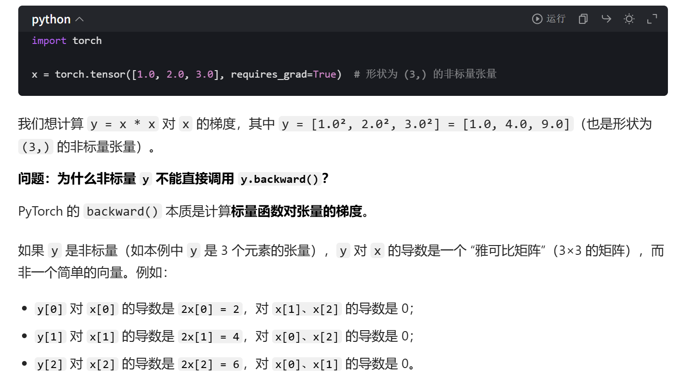||
        |--|--|
        ```
        # 对非标量调用backward需要传入一个gradient参数，该参数指定微分函数关于self的梯度。
        # 本例只想求偏导数的和，所以传递一个1的梯度是合适的
        x.grad.zero_()
        y = x * x
        # 对非标量 y 调用 backward，传入 gradient=全1张量
        # 等价于y.backward(torch.ones(len(x)))
        # torch.ones(len(x))等价于 torch.tensor([1.0, 1.0, 1.0])
        y.sum().backward()
        print(x.grad)                           # 输出：tensor([0., 2., 4., 6.])

        x.grad.zero_()      # 清空梯度
        y = x * x
        y_sum = y.sum()     # 标量：14.0
        y_sum.backward()    # 标量可直接求导

        # 传入 gradient=[2,3,4]
        y.backward(torch.tensor([2.0, 3.0, 4.0]))
        print(x.grad)  # 输出：tensor([4., 12., 24.])
        # 雅可比矩阵 × [2,3,4] = [2×2, 4×3, 6×4] = [4,12,24]，相当于计算 2*y[0] + 3*y[1] + 4*y[2] 对 x 的梯度。
        ```
    2. 分离计算
     detach()的作用 : 控制梯度的传播范围
        在 PyTorch 的自动求导中，计算图记录了张量的运算依赖关系。y.detach() 会创建一个新张量 u，它和 y 的数值完全相同，但断开了与原计算图的连接—— 即梯度不会从 u 反向传播到 y 的上游（比如 x） 
        1. 冻结部分参数：让某些层的参数不更新（如迁移学习中冻结预训练模型的底层）。
        2. 将中间结果视为 “常数”：在求导时忽略某部分计算对梯度的影响（如生成对抗网络中的 “截断梯度”）。
        3. 减少计算量：避免不必要的梯度计算，提升效率。
        ```
        y = x * x
        u = y.detach()          # 分离 y，得到 u（u 和 y 数值相同，但梯度不会传到 x）
        z = u * x               # 此时 u 被视为“常数”,因此 x.grad 的值等于 u

        z.sum().backward()
        x.grad == u             # 验证梯度是否等于 u
        > tensor([True, True, True, True])

        x.grad.zero_()          # 清空梯度
        y.sum().backward()      # 直接对 y = x² 的和求导
        x.grad == 2 * x         # 验证梯度是否等于 2x
        > tensor([True, True, True, True]) # 没有分离 y，所以计算图完整。
        ```
    1. Python控制流的梯度计算
    PyTorch 的自动微分（autograd）具有动态图【动态计算图（运行时构建计算图）】特性，即使函数中包含 Python 控制流（如 while 循环、if 条件判断），也能准确计算梯度。这是因为 PyTorch 会在运行时记录张量的运算路径，再反向传播计算梯度。
        1. 可以直接用 Python 原生的控制逻辑编写模型（无需学习特殊语法）；
        2. 支持动态结构的模型（如循环神经网络 RNN，其循环次数随输入长度变化）；
        3. 即使函数逻辑复杂（含条件分支、动态循环），梯度计算仍能 “自动且准确” 地完成。
        打破了 “控制流会阻碍梯度计算” 的限制，让开发者可以用更自然的 Python 逻辑编写可微分的函数。
        ```
        def f(a):
            b = a * 2
            while b.norm() < 1000:                    # 只要 b 的2 - 范数（norm()，即 √(b²)）小于 1000
                b = b * 2
            if b.sum() > 0:
                c = b
            else:
                c = 100 * b
            return c

        a = torch.randn(size=(), requires_grad=True)  # 创建需要求导的标量 a
        d = f(a)                                      # 调用含控制流的函数 f
        d.backward()                                  # 反向传播计算梯度
        print(a.grad == d / a)                        # 输出：tensor(True)
        # 对于任意 a，存在一个常数 k，使得 f(a) = k * a（即函数是分段线性的）
        ```
    1. 练习
    
        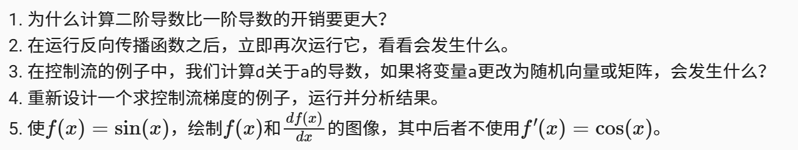
        答案： 
        1. 一阶导数是函数对自变量的 “直接变化率”，可通过一次反向传播计算。而二阶导数是 “导数的变化率”，需要对一阶导数的计算图再进行一次反向传播。
        2. 如果需要多次调用 backward()（例如累积梯度），需在第一次 backward() 时添加 retain_graph=True 参数，强制保留计算图，否则会报错。
        代码见code/practice5_2.py
        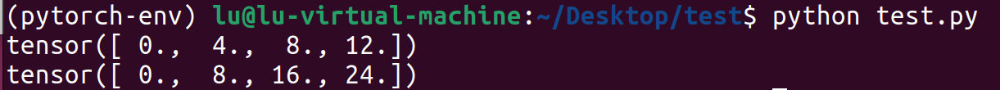
        3. backward() 要求标量输入，所以用 d.sum()
         代码见code/practice5_3.py
        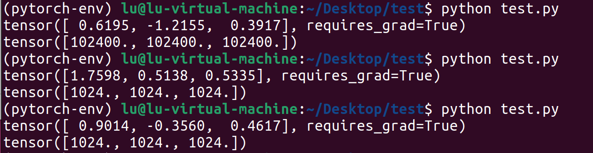
        4. 不能用y += 1, y += 1是原地操作,会破坏计算图中张量的历史记录，导致梯度无法正确追踪。将 y += 1 改为非原地操作（创建新张量）即可，例如用 y = y + 1 替代。
        代码见code/practice5_4.py
        
        分析过程：x=3 → 循环后y=5（3→4→5，循环3次）→ y=5不大于6 → z=5*3=15
        z对x的导数：z=15，且z=3*5=3*(x+3)（x从3到5循环加了3次），所以dz/dx=3
        5. 代码见code/practice5_4.py
        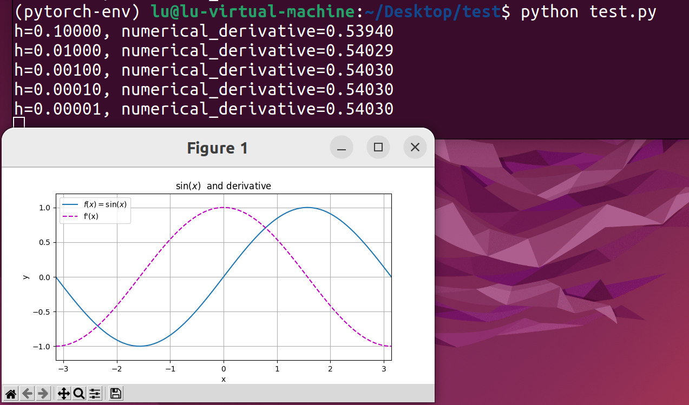
1. 概率
   机器学习就是做出预测
   1. 基本概率论
        ```
        import torch
        from torch.distributions import multinomial
        from d2l import torch as d2l

        # 除以 6 后，每个元素值为 1/6 ≈ 0.167，即每个点数出现的理论概率.
        # fair_probs = tensor([0.1667, 0.1667, 0.1667, 0.1667, 0.1667, 0.1667])
        fair_probs = torch.ones([6]) / 6
        # Multinomial(n, probs) 是多项式分布，用于模拟 “n 次独立实验” 中每个结果出现的次数。
        count1 = multinomial.Multinomial(1, fair_probs).sample()
        count10 = multinomial.Multinomial(10, fair_probs).sample()
        count100 = multinomial.Multinomial(100, fair_probs).sample()
        count1000 = multinomial.Multinomial(1000, fair_probs).sample()
        print("sample 1: ",count1)
        print("sample 10: ",count10)
        print("sample 100: ",count100)
        print("sample 1000: ",count1000)
        print("sample 1000: ",count1000/1000)
        ```
        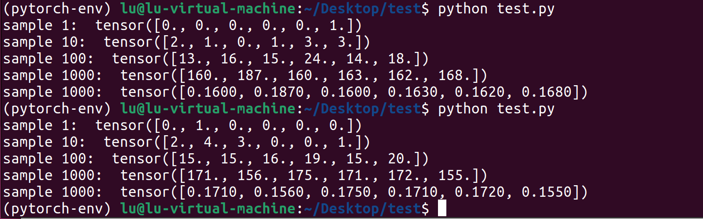
        ```
        import torch
        from torch.distributions import multinomial
        from d2l import torch as d2l

        fair_probs = torch.ones([6]) / 6
        counts = multinomial.Multinomial(10, fair_probs).sample((500,))   # .sample((500,))：生成 500 组这样的实验结果。counts 是形状为 (500, 6) 的张量。
        print(counts)
        cum_counts = counts.cumsum(dim=0)   # 按 “行方向（dim=0）” 做累加。
        print(cum_counts)
        print(cum_counts.shape)
        estimates = cum_counts / cum_counts.sum(dim=1, keepdims=True)    # 将 “累计次数” 转化为 “累计频率”
        print(estimates)
        print(estimates.shape)

        d2l.set_figsize((6, 4.5))                                   # 设置图像尺寸
        for i in range(6):                                          # 绘制 6 个点数的频率变化曲线
            d2l.plt.plot(estimates[:, i].numpy(),                   # .numpy()：将 PyTorch 张量转为 NumPy 数组（d2l.plt 支持 NumPy 数组绘图）；
                        label=("P(die=" + str(i + 1) + ")"))        # label：为每条曲线设置图例，标注对应点数的概率（如 P(die=1) 表示点数 1 的概率估计）。
        d2l.plt.axhline(y=0.167, color='black', linestyle='dashed') # 绘制理论概率参考线
        d2l.plt.gca().set_xlabel('Groups of experiments')
        d2l.plt.gca().set_ylabel('Estimated probability')           # 设置坐标轴标签
        d2l.plt.legend();                                           # 显示图例
        d2l.plt.show()

        ```
        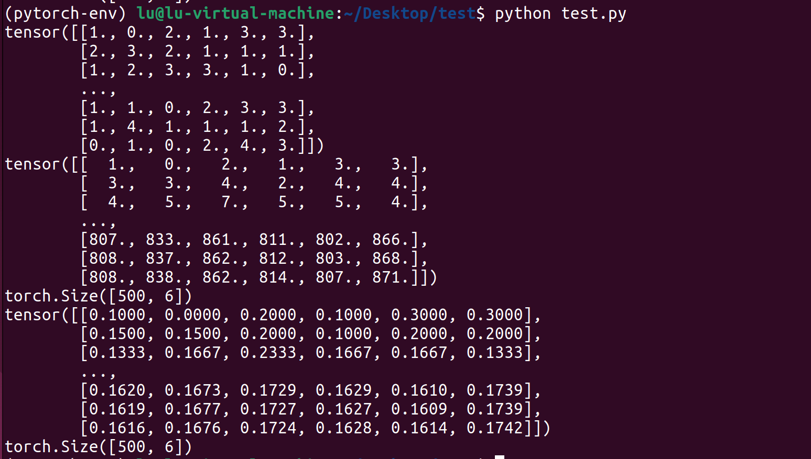
        将看到某个数值的可能性量化为密度（density）。 
    2. 处理多个随机变量
        |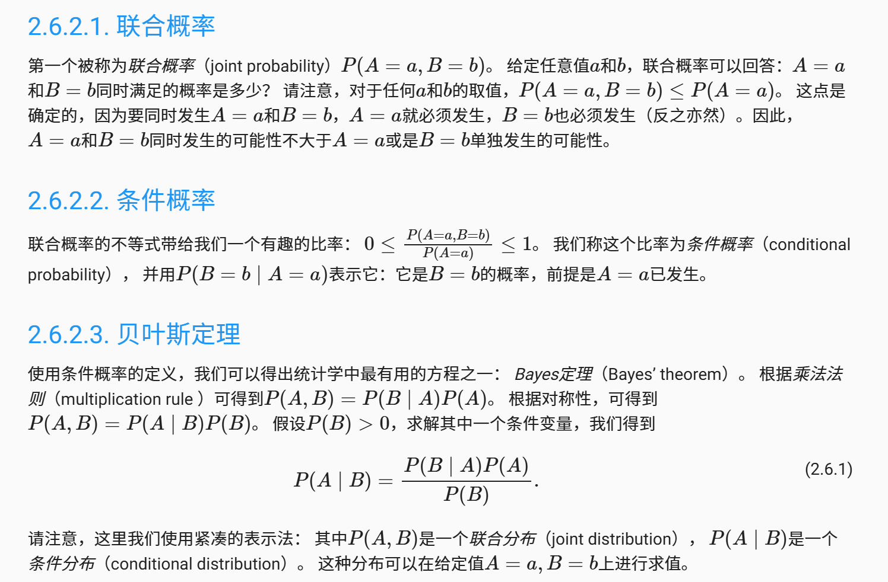|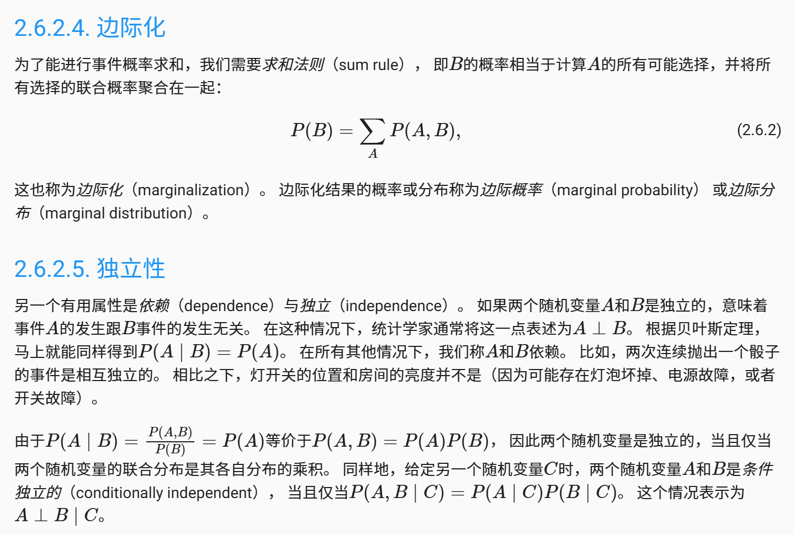|
        |--|--|
    3. 期望和方差
        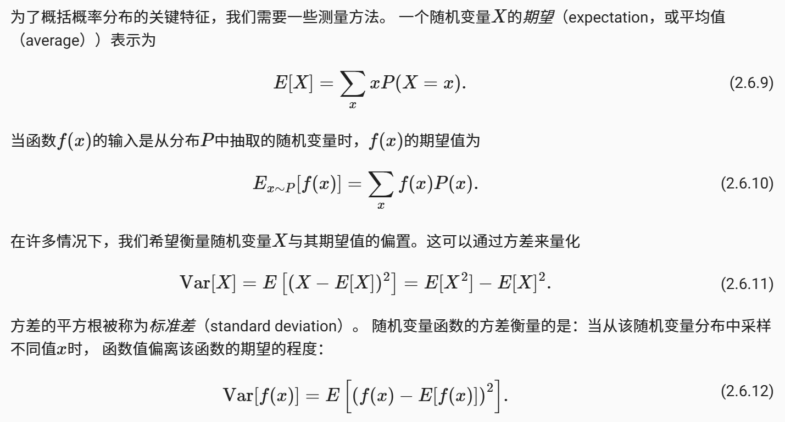
    4. 练习
        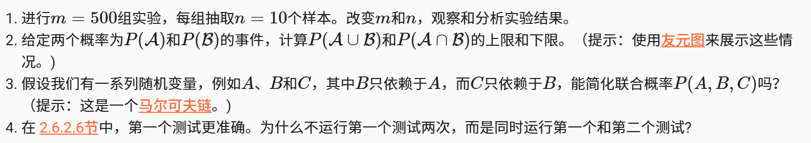
        答案：
        1. 代码见code/practice6_1.py
            |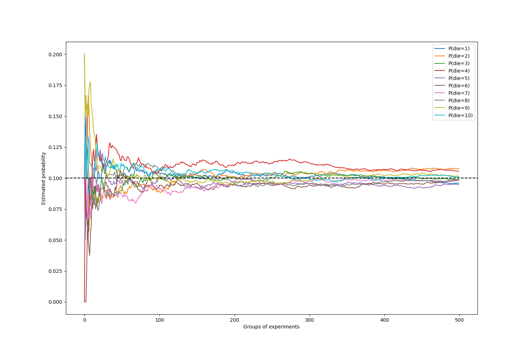|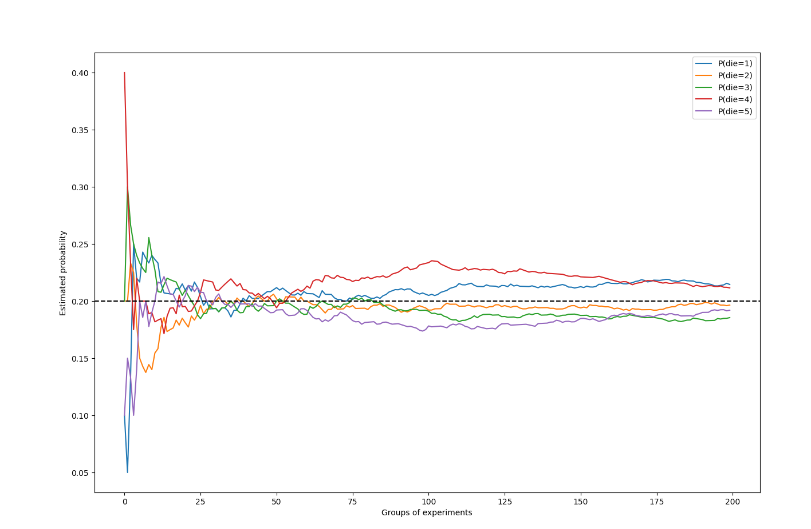|
            |--|--|
            | m = 500 , n = 10| m = 200 , n = 5|

            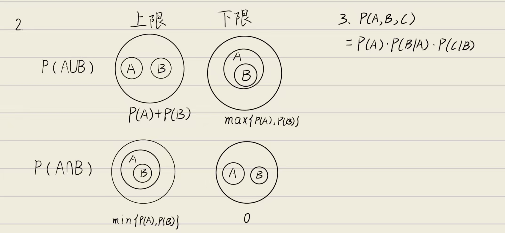
        2. 为了避免统计相关性导致的错误：
            若两次运行同一测试，测试结果会因重复抽样或同一分布的固有相关性产生依赖，导致统计推断的 “显著性” 被高估。而运行两个不同的测试可利用测试间的独立性，更准确地判断结果是否由 “真实差异” 而非 “随机波动” 导致，从而提升推断的可靠性。

#### 线性神经网络
1. 线性回归（linear regression）
   回归（regression）是能为一个或多个自变量与因变量之间关系建模的一类方法。 在自然科学和社会科学领域，回归经常用来表示输入和输出之间的关系。
   在机器学习的术语中，数据集称为训练数据集（training data set） 或训练集（training set）。 每行数据称为样本（sample）， 也可以称为数据点（data point）或数据样本（data instance）。 把试图预测的目标称为标签（label）或目标（target）。 预测所依据的自变量称为特征（feature）或协变量（covariate）。
   1. 基本元素（从模型到优化）
       1. 线性模型
        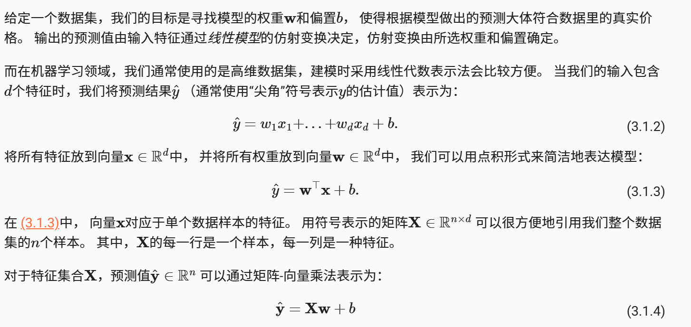
        1. 损失函数（loss function）
        模型评估标准
        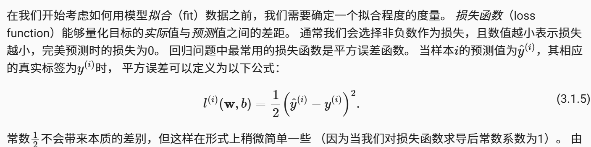
        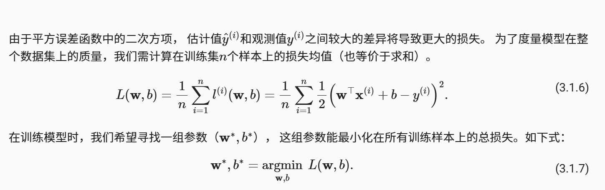
        3. 解析解
         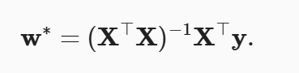
        4. 随机梯度下降
         用以训练难以优化的模型 （无法得到解析解的情况）
        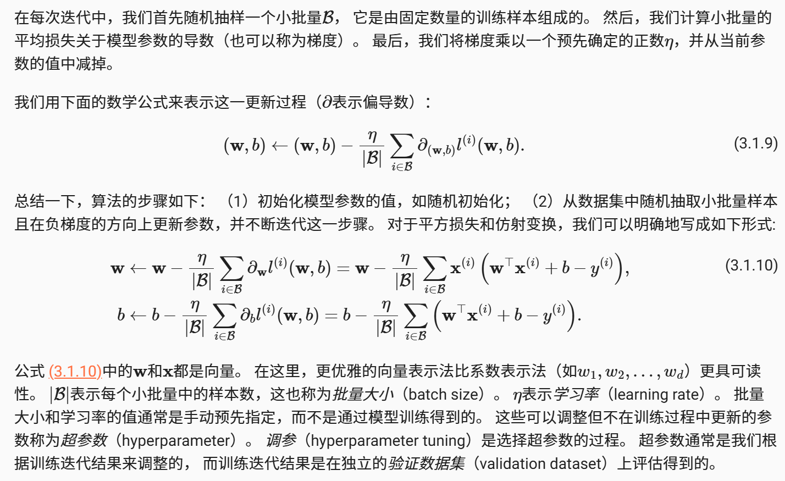
        算法会使得损失向最小值缓慢收敛，但却不能在有限的步数内非常精确地达到最小值。
        4. 用模型预测
        给定特征估计目标的过程通常称为预测（prediction）或推断（inference） 
    2. 矢量化加速
    利用线性代数库，同时处理整个小批量的样本
    本质：将标量运算转化为张量（向量 / 矩阵）运算，减少计算开销并降低出错概率。 
        ```
        import math
        import time
        import numpy as np
        import torch
        from d2l import torch as d2l

        n = 10000
        a = torch.ones([n])
        b = torch.ones([n])

        # 计时器
        class Timer:  #@save
            """记录多次运行时间"""
            def __init__(self):
                self.times = []
                self.start()

            def start(self):
                """启动计时器"""
                self.tik = time.time()

            def stop(self):
                """停止计时器并将时间记录在列表中"""
                self.times.append(time.time() - self.tik)
                return self.times[-1]

            def avg(self):
                """返回平均时间"""
                return sum(self.times) / len(self.times)

            def sum(self):
                """返回时间总和"""
                return sum(self.times)

            def cumsum(self):
                """返回累计时间"""
                return np.array(self.times).cumsum().tolist()

        c = torch.zeros(n)
        timer = Timer()
        for i in range(n):
            c[i] = a[i] + b[i]
        print(f'{timer.stop():.5f} sec')
        timer.start()
        d = a + b
        print(f'{timer.stop():.5f} sec' )    
        > 0.10727 sec
        > 0.00014 sec     # 矢量化代码通常会带来数量级的加速。
        ```
    3. 正态分布与平方损失
        ```
        import math
        import numpy as np
        import torch
        from d2l import torch as d2l

        def normal(x, mu, sigma):
            """
            定义正态分布概率密度函数
            参数:
                x: 输入的自变量（一维数组）
                mu: 均值
                sigma: 标准差
            返回:
                正态分布在x处的概率密度值
            """
            p = 1 / math.sqrt(2 * math.pi * sigma**2)  # 正态分布的归一化系数
            return p * np.exp(-0.5 / sigma**2 * (x - mu)**2)  # 正态分布的指数部分

        # 生成x的取值范围：从-7到7，步长0.01，用于绘制连续曲线
        x = np.arange(-7, 7, 0.01)

        # 定义多组均值（mu）和标准差（sigma）的组合，用于绘制不同的正态分布曲线
        params = [(0, 1), (0, 2), (3, 1)]

        # 调用d2l的绘图函数，绘制多条正态分布曲线
        d2l.plot(
            x,  # x轴数据
            [normal(x, mu, sigma) for mu, sigma in params],  # y轴数据：每组参数对应的正态分布曲线
            xlabel='x',  # x轴标签
            ylabel='p(x)',  # y轴标签（概率密度）
            figsize=(15, 10),  # 图像尺寸
            legend=[f'mean {mu}, std {sigma}' for mu, sigma in params]  # 图例，标注每组参数
        )

        d2l.plt.show()
        ```
        |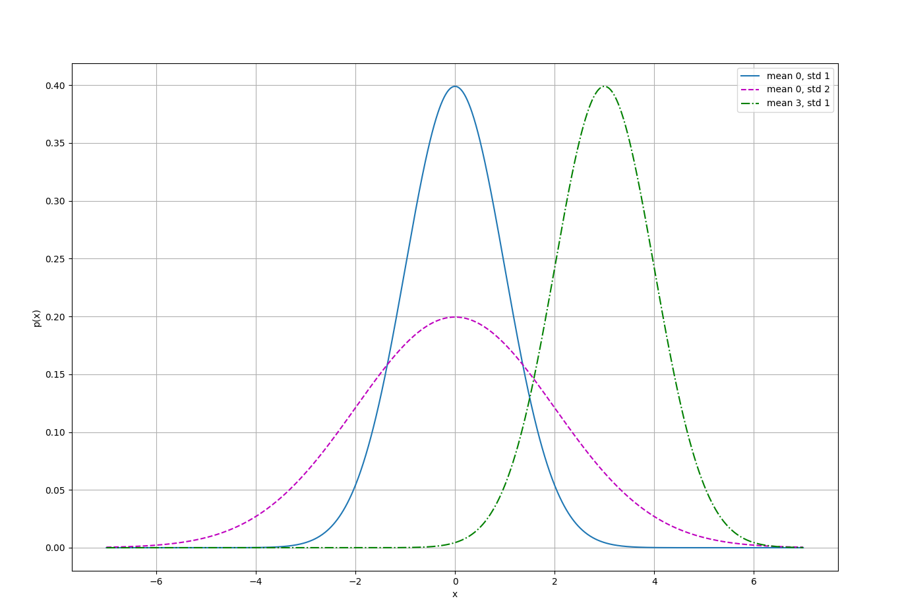|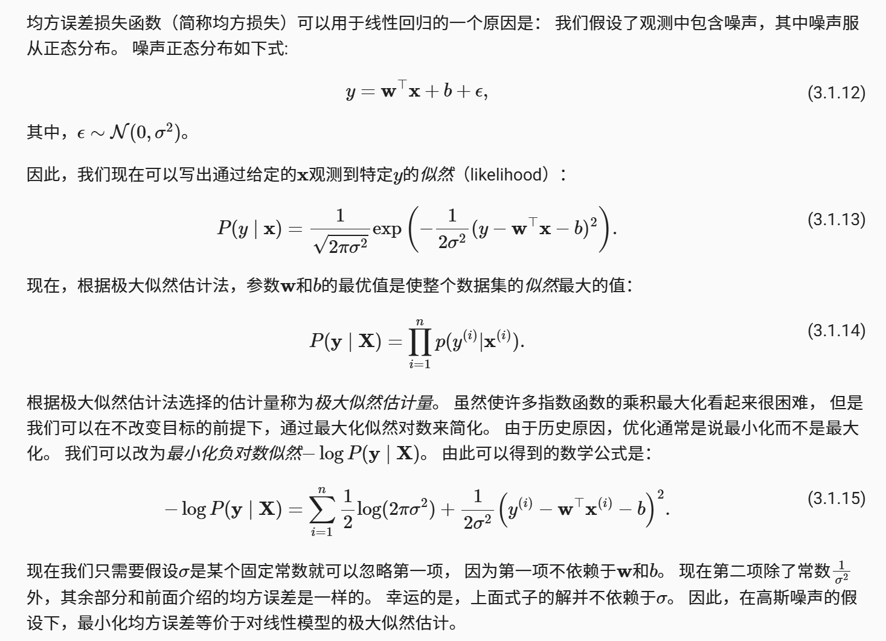|
        |--|--|
    4. 从线性回归到深度网络
        1. 神经网络图
         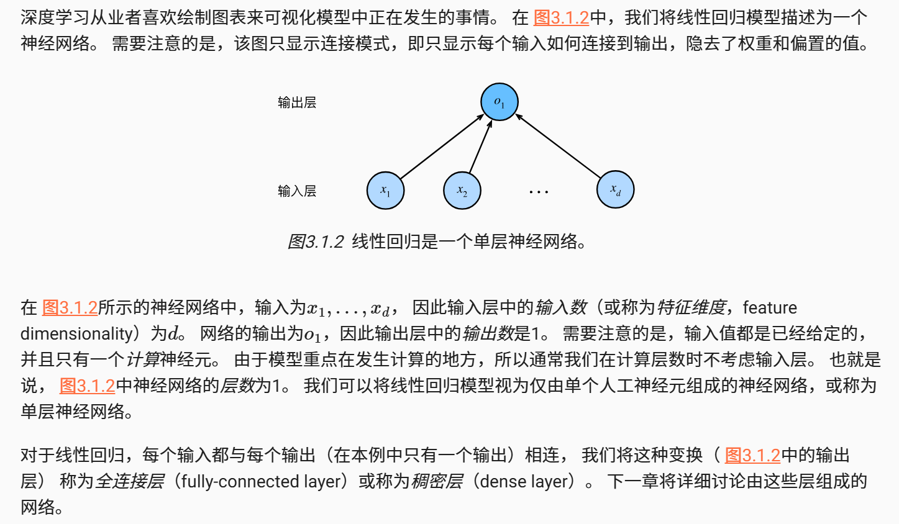
            > 一开始看名字没想起来是啥，看图想起来了
        2. 生物学
            > 啊，生物学，想起了上过的生物信息学

        线性回归模型也是一个简单的神经网络
2. 线性回归的从零开始实现
    深度学习训练的核心流程：数据生成→参数初始化→前向传播→反向传播→参数更新
    教程代码见：code/linear_model.py
    结果：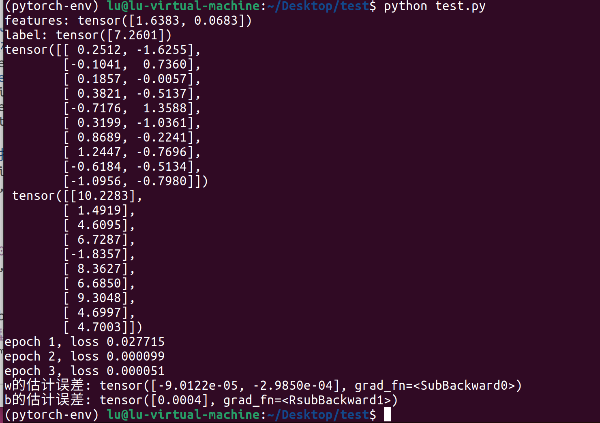


