# python学习
教程：https://www.runoob.com/python/python-tutorial.html
## 基础语句
#### 输出 
```
print("hello world!")
#输出变量x的值
print(x)
```
#### 等待用户输入
```
#从标准输入读取一个行，并返回一个字符串（去掉结尾的换行符）
raw_input("按下 enter 键退出，其他任意键显示...\n")
#举例
str = raw_input("请输入：")
print(str)

#和 raw_input() 函数基本类似，但是 input 可以接收一个Python表达式作为输入，并将运算结果返回
input()
#举例
str = input("请输入：")
print ("你输入的内容是: ", str)
   请输入：[x*5 for x in range(2,10,2)]
   你输入的内容是:  [10, 20, 30, 40]
```
#### 变量定义赋值
```
变量名 = 变量值
 ```
#### 条件语句
```
 if 判断条件1:
    执行语句1……
elif 判断条件2:
    执行语句2……
elif 判断条件3:
    执行语句3……
else:
    执行语句4……
```
python 并不支持 switch 语句,有多个条件时可使用括号来区分判断的先后顺序
#### 循环语句
##### while
```
while 判断条件：
    执行语句   #与该句缩进字符相同的语句均为while满足执行条件时会运行的语句

# while...else...  在循环条件为 false 时执行 else 语句块
while 判断条件：
    执行语句
else :
    执行语句
```
##### for
```
for iterating_var in sequence:
   执行语句

#for...else...  else中的语句会在循环正常执行完（即 for 不是通过 break 跳出而中断的）的情况下执行
for ... :
   执行语句
else  ：
   执行语句
```
实例：

##### 循环嵌套
注意缩进，同一级循环的缩进格式要相同
##### break 、 continue 和pass
break 来跳出循环，continue 用于跳过该次循环，pass 是空语句，是为了保持程序结构的完整性。
pass 不做任何事情，一般用做占位语句，不影响输出结果。
#### 删除语句
```del var1,var2```

## 基础语法
1. 以下划线开头的标识符是有特殊意义的。以单下划线开头 _foo 的代表不能直接访问的类属性，需通过类提供的接口进行访问，不能用 from xxx import * 而导入。
1. 以双下划线开头的 __foo 代表类的私有成员，以双下划线开头和结尾的 __foo__ 代表 Python 里特殊方法专用的标识，如 __init__() 代表类的构造函数。
1. Python 可以同一行显示多条语句，方法是用分号 ; 分开，如：
   ```print ('hello');print ('runoob');```
1. python保留字符
   
1. 注意所有代码块语句必须包含相同的缩进空白数量
1. 以新行作为语句的结束符，但可以使用斜杠（ \）将一行的语句分为多行显示。语句中包含 [], {} 或 () 括号则不需要使用多行连接符。
1. 单行注释用#开头，多行注释使用三个单引号 ''' 或三个双引号 """
1. 引号( ' )、双引号( " )、三引号( ''' 或 """ ) 表示字符串。三引号可以由多行组成，编写多行文本的快捷语法，常用于文档字符串，在文件的特定地点，被当做注释（头尾引号各自单独一行，把要注释的内容夹在中间）。
   ```
   paragraph = """这是一个段落。
   包含了多个语句"""
   ```

## 数据类型
##### Numbers（数字）
* int（有符号整型）
* long（长整型，也可以代表八进制和十六进制）
* float（浮点型）
* complex（复数）: a + bj 或者 complex(a,b) a,b为浮点型

##### String（字符串）
 |||
 |--|--|
 |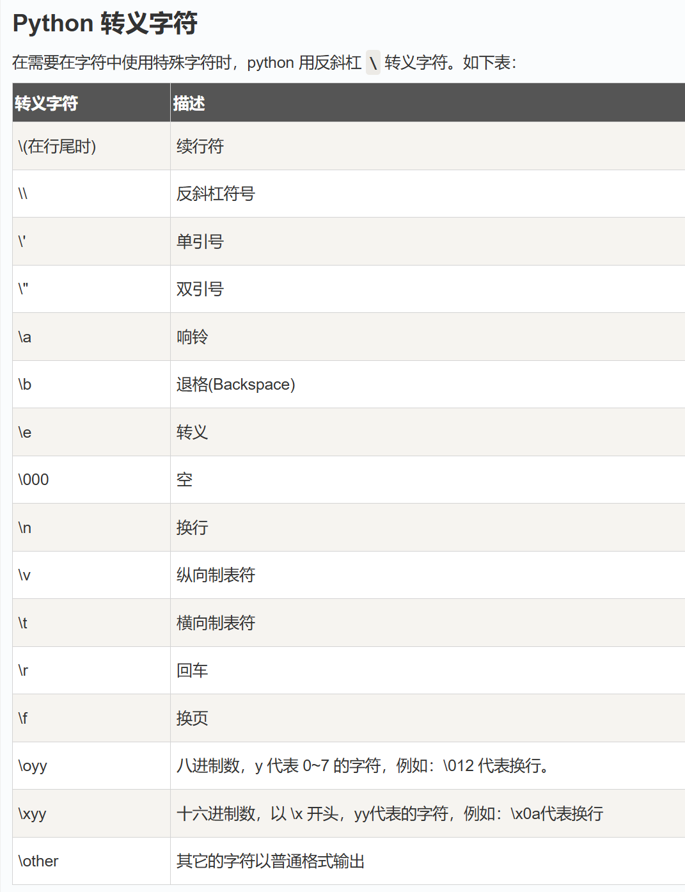|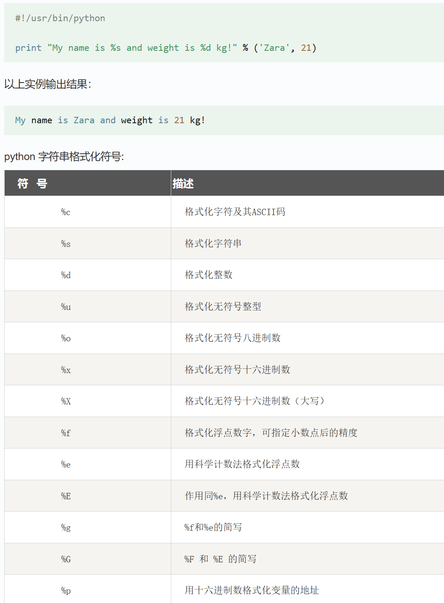|
 |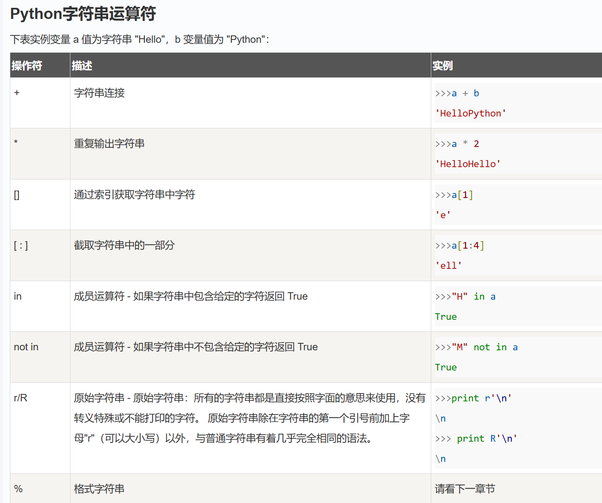|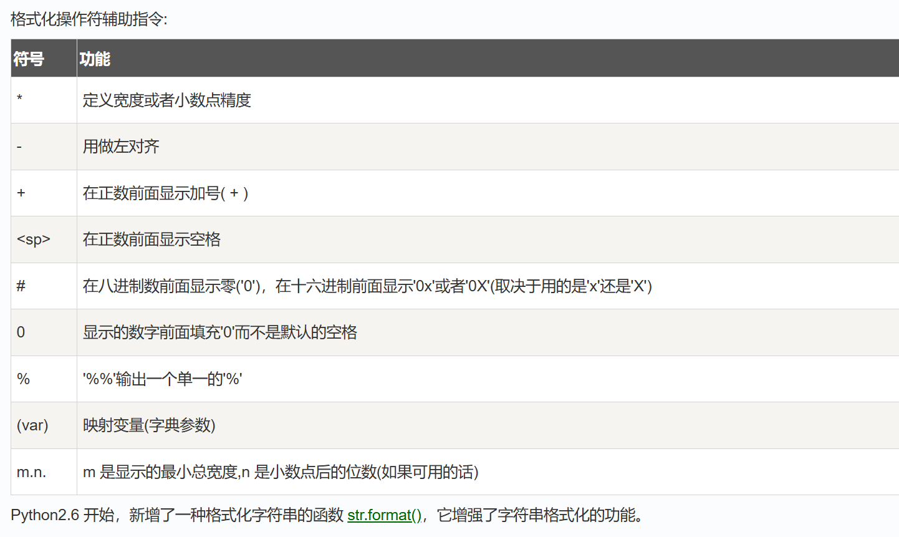|

##### List（列表）
列表可以完成大多数集合类的数据结构实现。它支持字符，数字，字符串甚至可以包含列表（即嵌套）。
 
```
list = []          ## 空列表
list.append('Google')   ## 使用 append() 添加元素
list.append('Runoob')
print list
['Google', 'Runoob']  ## 输出
del list[2]    ##使用del删除列表第三个元素
del list       ##使用del删除列表
```
| 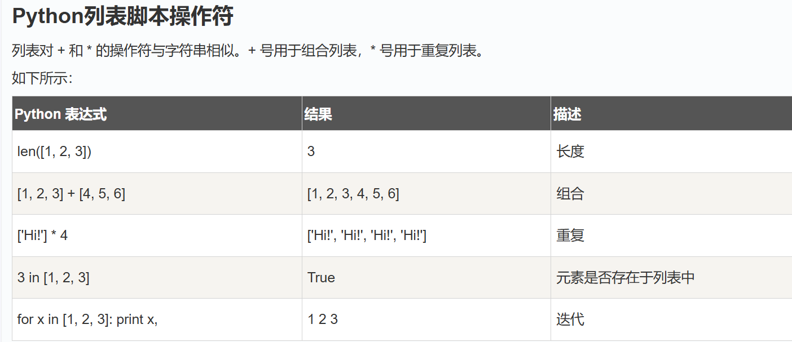  |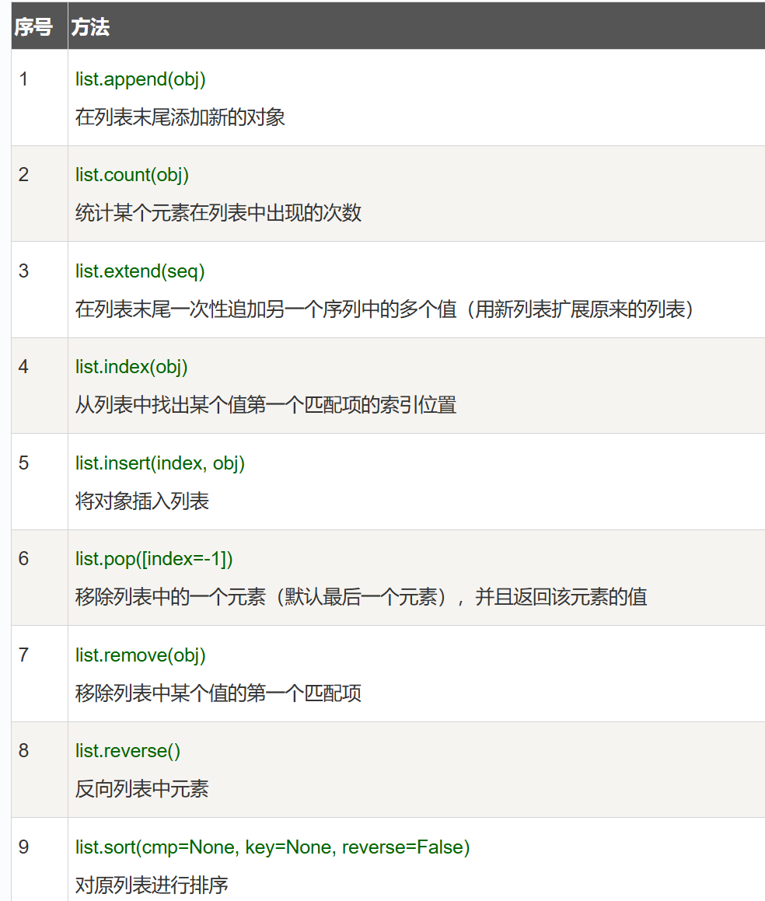|
|:--------------------:|:--------------------:|

##### Tuple（元组）
同List区别在于Tuple只读，不可修改
元组不可修改和删除元素，但可组合或直接用del删除整个元组
 
 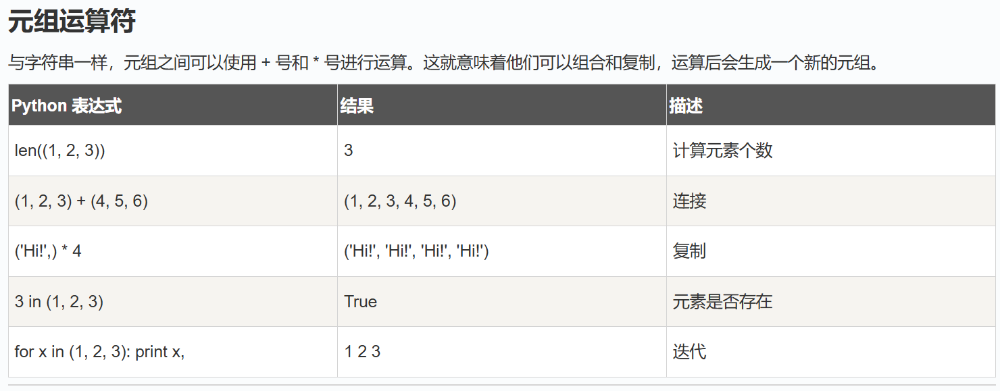

##### Dictionary（字典）
列表是有序的对象集合，字典是无序的对象集合。
字典当中的元素是通过键来存取的，而不是通过偏移存取。
字典由索引(key)和它对应的值value组成。键 ：值
不允许同一个键出现两次。创建时如果同一个键被赋值两次，后一个值会被记住
键必须不可变，所以可以用数字，字符串或元组充当，所以用列表就不行
 |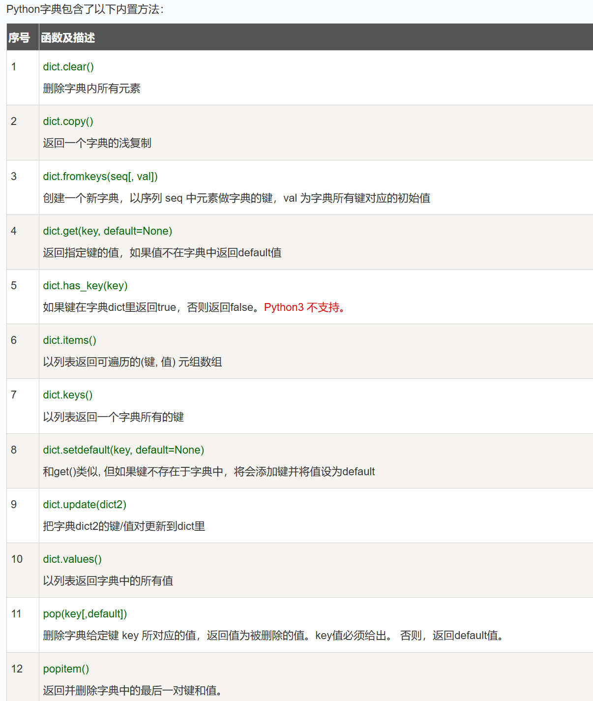|
|:--------------------:|:--------------------:|
```
tinydict['Age'] = 8           # 更新
tinydict['School'] = "RUNOOB" # 添加
del tinydict['Name']          # 删除键是'Name'的条目
tinydict.clear()              # 清空字典所有条目
del tinydict                  # 删除字典
```

## 数据类型转换


## 运算符
#### 运算符分类
##### 算术运算符
> " +  "   
> " - " 
> " * " 
> " %  "
x**y：幂 - 返回x的y次幂
x//y:取整除 - 返回商的整数部分（向下取整）
##### 比较运算符
>" == "
" != " 
" >= " 
" <= "
" > "
" < "
##### 赋值运算符
> " = "
##### 位运算符
> " & "
> " | "
> " ^ "
> " ~ "
> " << " :左移动运算符：运算数的各二进位全部左移若干位，由 << 右边的数字指定了移动的位数，高位丢弃，低位补0。
> " >> " :右移动运算符：把">>"左边的运算数的各二进位全部右移若干位，>> 右边的数字指定了移动的位数
##### 逻辑运算符
> " x and y " :布尔"与" - 如果 x 为 False，x and y 返回 False，否则它返回 y 的计算值。0为False
> " x or y " :布尔"或" - 如果 x 是非 0，它返回 x 的计算值，否则它返回 y 的计算值。
> " not x " :布尔"非" - 如果 x 为 True，返回 False 。如果 x 为 False，它返回 True。
##### 成员运算符
> " x in y " :如果在指定的序列y中找到值x返回 True，否则返回 False。
> " x not in y " :
#### 运算符优先级


## 函数
#### 内置函数
| 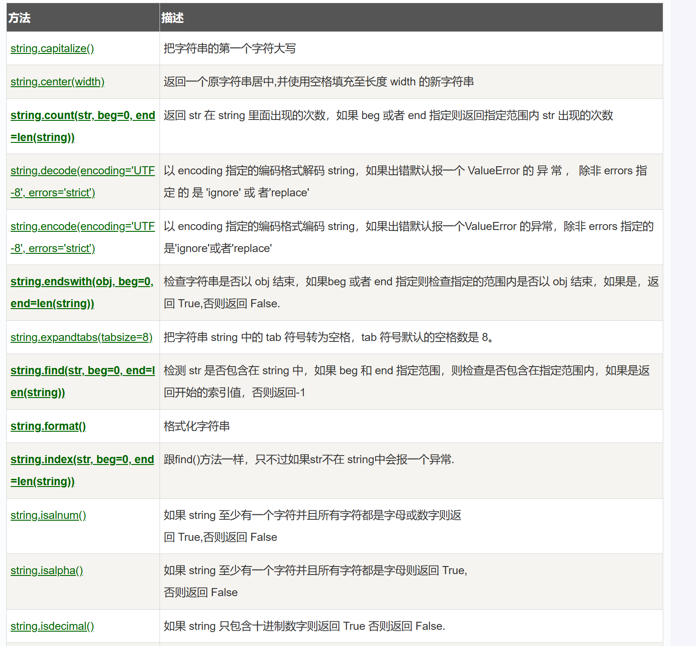  | 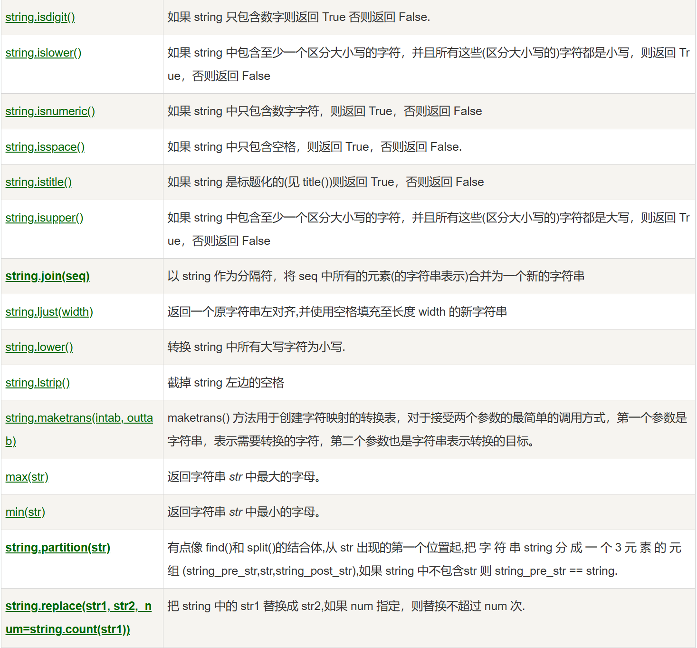 |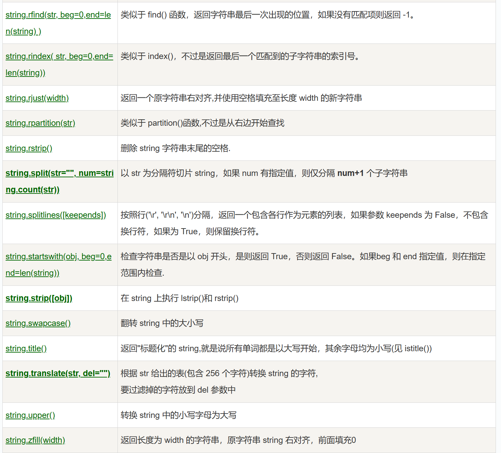 |
|:--------------------:|:--------------------:|:--------------------:|
| 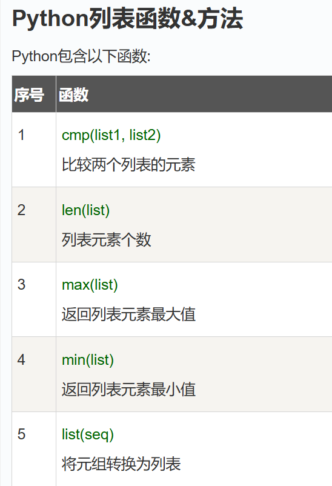  | 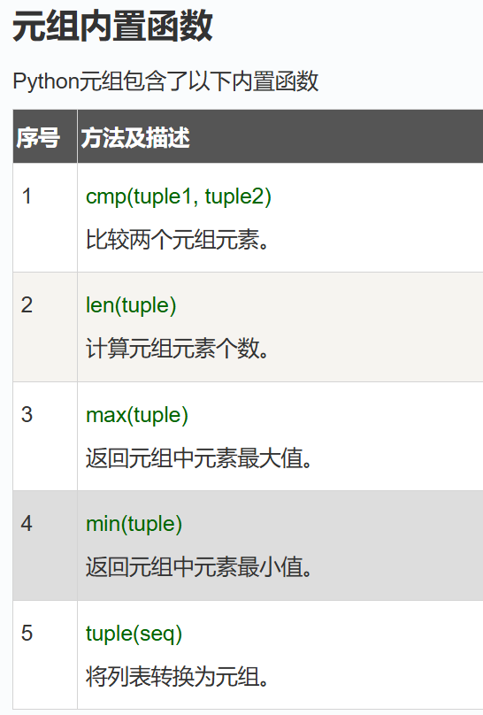 |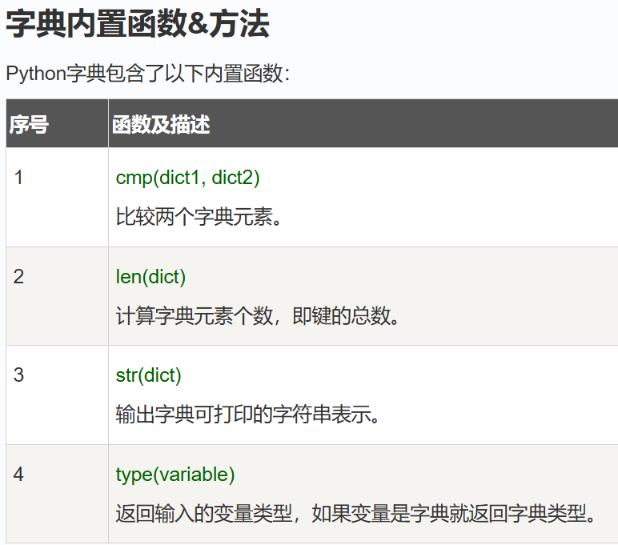 |
其他内置函数见https://www.runoob.com/python/python-built-in-functions.html
#### 定义函数
1. 语法
```
def functionname( parameters ):
   "函数_文档字符串"          #函数的第一行语句可以选择性地使用文档字符串—用于存放函数说明。
   function_suite
   return [expression]      #return [表达式] 结束函数，选择性地返回一个值给调用方。不带表达式的return相当于返回 None
```
2. 函数调用
```
def printme(str):
   "打印任何传入的字符串"
   print(str)
   return
# 调用函数
printme("我要调用用户自定义函数!")
printme("再次调用同一函数")
```
3. 参数传递
   strings, tuples, 和 numbers 是不可更改的对象，而 list,dict 等则是可以修改的对象。不可变类型：类似 c++ 的值传递。可变类型：类似 c++ 的引用传递。
   不定长参数：
   ```
   def functionname([formal_args,] *var_args_tuple ):
   "函数_文档字符串"
   function_suite
   return [expression]

   # 举例
   def printinfo( arg1, *vartuple ):
      "打印任何传入的参数"
      print "输出: "
      print arg1
      for var in vartuple:
         print var
      return
   printinfo( 10 )
   printinfo( 70, 60, 50 )
   ```
3. 匿名函数
   1. 规则
      1. lambda只是一个表达式，函数体比def简单很多。
      2. lambda的主体是一个表达式，而不是一个代码块。仅仅能在lambda表达式中封装有限的逻辑进去。
      3. lambda函数拥有自己的命名空间，且不能访问自有参数列表之外或全局命名空间里的参数。
      4. 虽然lambda函数看起来只能写一行，却不等同于C或C++的内联函数，后者的目的是调用小函数时不占用栈内存从而增加运行效率。
   2. 语法
   ```
   lambda [arg1 [,arg2,.....argn]]:expression

   #举例
   sum = lambda arg1, arg2: arg1 + arg2
   print "相加后的值为 : ", sum( 10, 20 )
   print "相加后的值为 : ", sum( 20, 20 )
   ```
4. return语句和变量作用域

## 模块
模块(Module)，是一个 Python 文件，以 .py 结尾，包含了 Python 对象定义和Python语句。
#### 语句
```
import module1[, module2[,... moduleN]]         # import 语句来引入模块
from modname import name1[, name2[, ... nameN]] #从模块中导入一个指定的部分
from modname import *                           #把一个模块的所有内容全都导入
global VarName                                  #告诉 Python， VarName 是一个全局变量
dir()                                           #是一个排好序的字符串列表，内容是一个模块里定义过的名字。
                                                #返回的列表容纳了在一个模块里定义的所有模块，变量和函数。
globals()                                       #在函数内部调用，返回的是所有在该函数里能访问的全局名字。
locals()                                        #在函数内部调用，返回的是所有能在该函数里访问的命名。
reload(module_name)                             #重新导入之前导入过的模块

```
#### 包
包是一个分层次的文件目录结构，它定义了一个由模块及子包，和子包下的子包等组成的 Python 的应用环境。
简单来说，包就是文件夹，但该文件夹下必须存在 \__init__.py 文件, 该文件的内容可以为空。\__init__.py 用于标识当前文件夹是一个包。
#### 数学运算常用
```
# math 模块提供了许多对浮点数的数学运算函数。
>>>import math
>>>dir(math)
['__doc__', '__file__', '__loader__', '__name__', '__package__', '__spec__', 'acos', 'acosh', 'asin', 
'asinh', 'atan', 'atan2', 'atanh', 'ceil', 'copysign', 'cos', 'cosh', 'degrees', 'e', 'erf', 
'erfc', 'exp', 'expm1', 'fabs', 'factorial', 'floor', 'fmod', 'frexp', 'fsum', 'gamma', 'gcd', 
'hypot', 'inf', 'isclose', 'isfinite', 'isinf', 'isnan', 'ldexp', 'lgamma', 'log', 'log10',
 'log1p', 'log2', 'modf', 'nan', 'pi', 'pow', 'radians', 'sin', 'sinh', 'sqrt', 'tan', 'tanh', 
 'tau', 'trunc']

# cmath 模块包含了一些用于复数运算的函数。
>>> import cmath
>>> dir(cmath)
['__doc__', '__file__', '__loader__', '__name__', '__package__', '__spec__', 'acos', 'acosh', 'asin',
 'asinh', 'atan', 'atanh', 'cos', 'cosh', 'e', 'exp', 'inf', 'infj', 'isclose', 'isfinite',
  'isinf', 'isnan', 'log', 'log10', 'nan', 'nanj', 'phase', 'pi', 'polar', 'rect', 'sin',
   'sinh', 'sqrt', 'tan', 'tanh', 'tau']

# 区别是 cmath 模块运算的是复数，math 模块运算的是数学运算。
# 实例
>>> import cmath
>>> a = -1
>>> a = cmath.sqrt(a)
>>> print(a)
1j
```

| 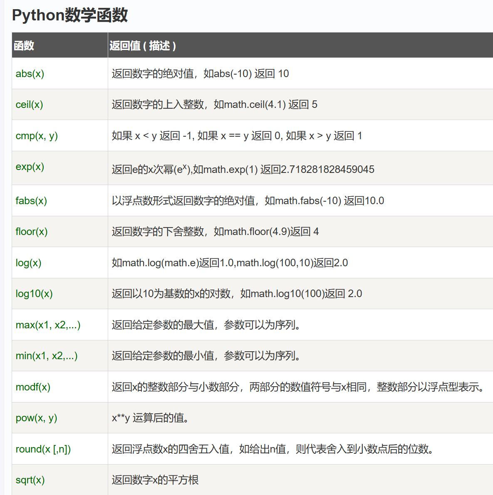  |  |
|--------------------|--------------------|
| 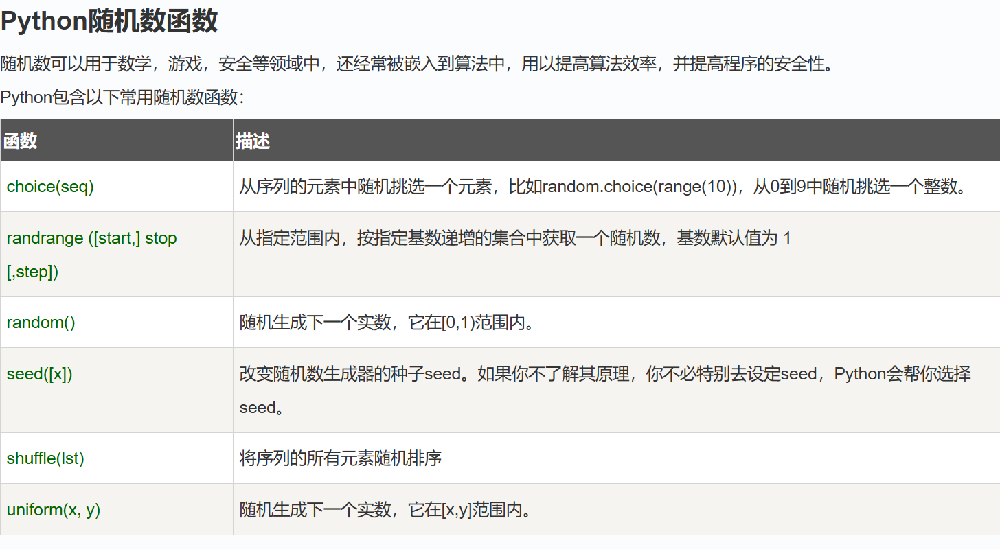 | 

#### 日期和时间
```
import time
ticks = time.time()                    #获取当前时间戳
localtime = time.localtime(time.time())#获取当前时间,从返回浮点数的时间戳方式向时间元组转换

localtime = time.asctime( time.localtime(time.time()) )#获取格式化的时间
Thu Apr  7 10:05:21 2016                               #输出
# 格式化成2016-03-20 11:45:39形式
print time.strftime("%Y-%m-%d %H:%M:%S", time.localtime()) 
# 格式化成Sat Mar 28 22:24:24 2016形式
print time.strftime("%a %b %d %H:%M:%S %Y", time.localtime()) 
# 将格式字符串转换为时间戳
a = "Sat Mar 28 22:24:24 2016"
print time.mktime(time.strptime(a,"%a %b %d %H:%M:%S %Y"))
```
```
%y 两位数的年份表示（00-99）     %Y 四位数的年份表示（000-9999）
%m 月份（01-12）                %d 月内中的一天（0-31）
%H 24小时制小时数（0-23）        %I 12小时制小时数（01-12）
%M 分钟数（00-59）               %S 秒（00-59）
%a 本地简化星期名称              %A 本地完整星期名称
%b 本地简化的月份名称            %B 本地完整的月份名称
%c 本地相应的日期表示和时间表示   %j 年内的一天（001-366）
%p 本地A.M.或P.M.的等价符        %U 一年中的星期数（00-53）星期天为星期的开始
%w 星期（0-6）星期天,为星期的开始 %W 一年中的星期数（00-53）星期一为星期的开始
%x 本地相应的日期表示            %X 本地相应的时间表示
%Z 当前时区的名称                %% %号本身
```
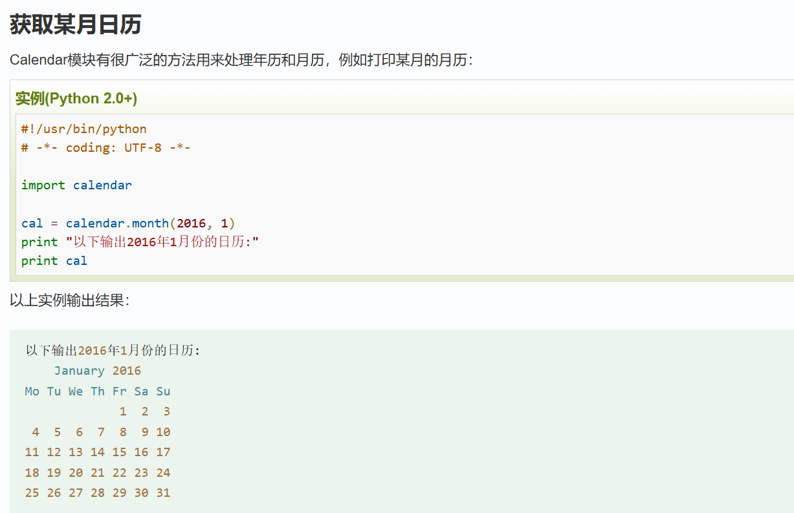
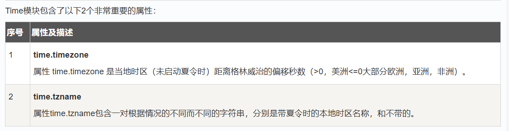
| 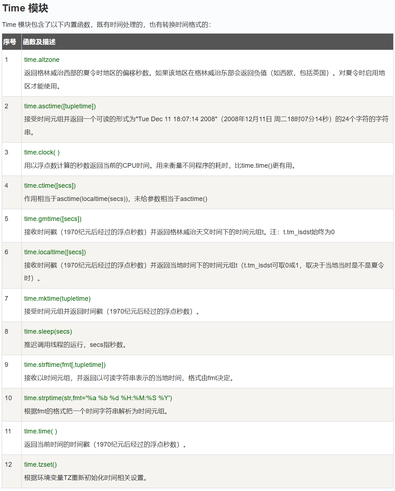  | 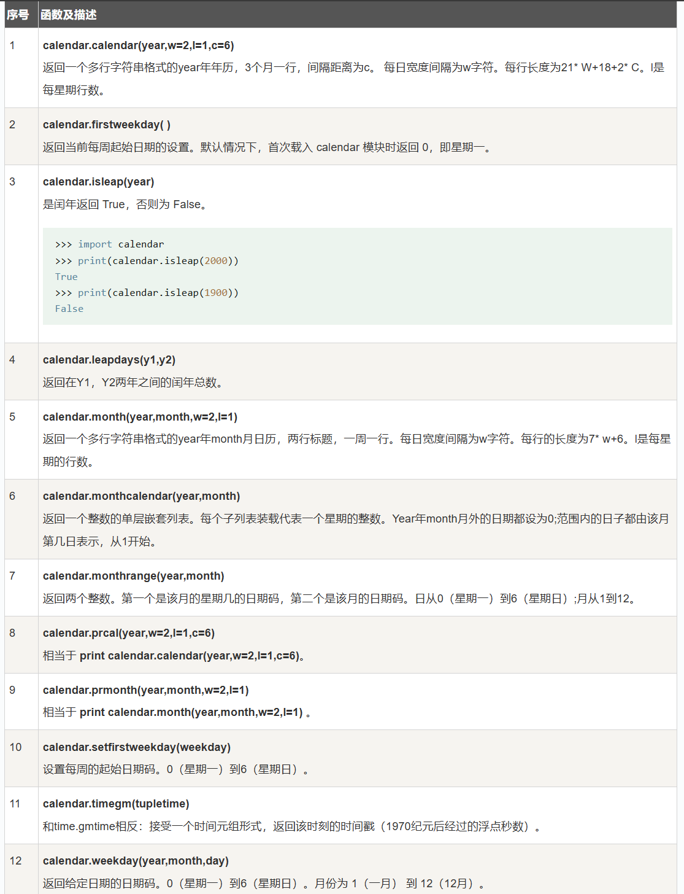 |
|--------------------|--------------------|

## 文件I/O
#### 基本的 I/O 函数
```
# 打开一个文件，创建一个file对象
file object = open(file_name [, access_mode][, buffering])
# 刷新缓冲区里任何还没写入的信息，并关闭该文件
fileObject.close()
# 将任何字符串写入一个打开的文件，不会在字符串的结尾添加换行符('\n')
fileObject.write(string)
#从一个打开的文件中读取一个字符串,count是要从已打开文件中读取的字节计数,没有count则尽量读取全部文件内容
fileObject.read([count])
# 指针在当前文件位置
tell()
# 改变当前文件的位置。Offset变量表示要移动的字节数。From变量指定开始移动字节的参考位置
seek（offset [,from]）
# 查看文件内容
cat file_name

import os
# 重命名
os.rename(current_file_name, new_file_name)
# 删除文件
os.remove(file_name)
# 在当前目录下创建新的目录，newdir为新的目录名
os.mkdir("newdir")
# 改变当前的目录到newdir
os.chdir("newdir")
# 显示当前的工作目录
os.getcwd()
# 删除目录，删除之前，它的所有内容应该先被清除。
os.rmdir('dirname')
```
注：
1. file_name：file_name变量是一个包含了你要访问的文件名称的字符串值。
1. access_mode：access_mode决定了打开文件的模式：只读，写入，追加等。所有可取值见如下的完全列表。这个参数是非强制的，默认文件访问模式为只读(r)。
1. buffering:如果buffering的值被设为0，就不会有寄存。如果buffering的值取1，访问文件时会寄存行。如果将buffering的值设为大于1的整数，表明了这就是的寄存区的缓冲大小。如果取负值，寄存区的缓冲大小则为系统默认。

|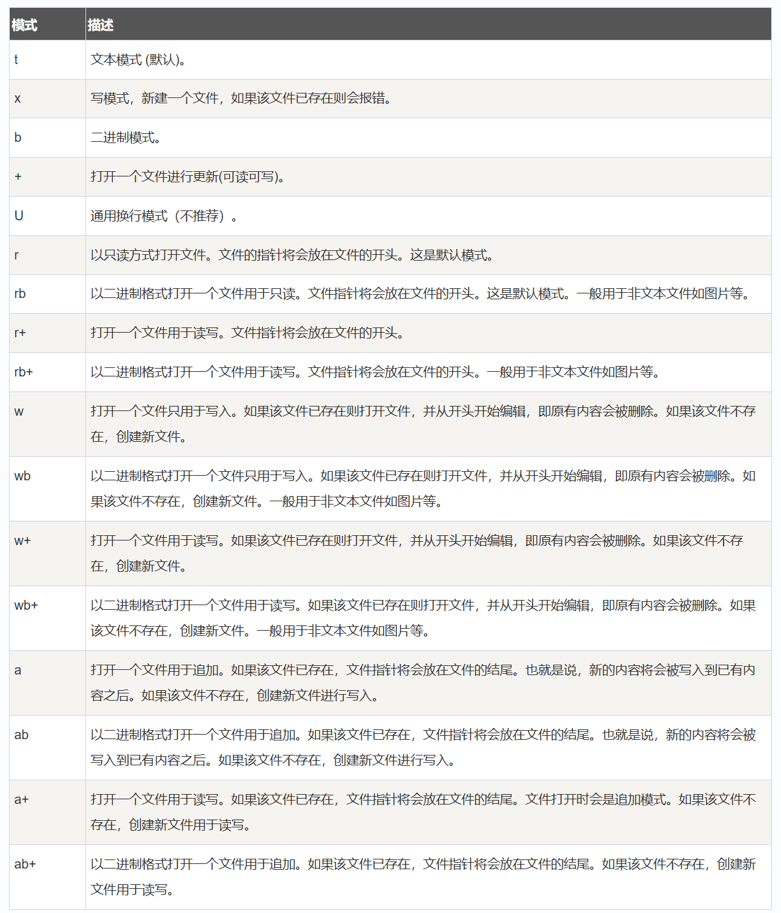|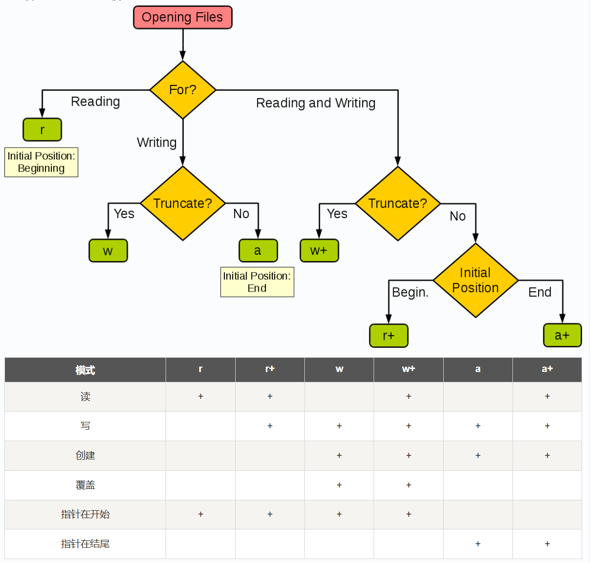|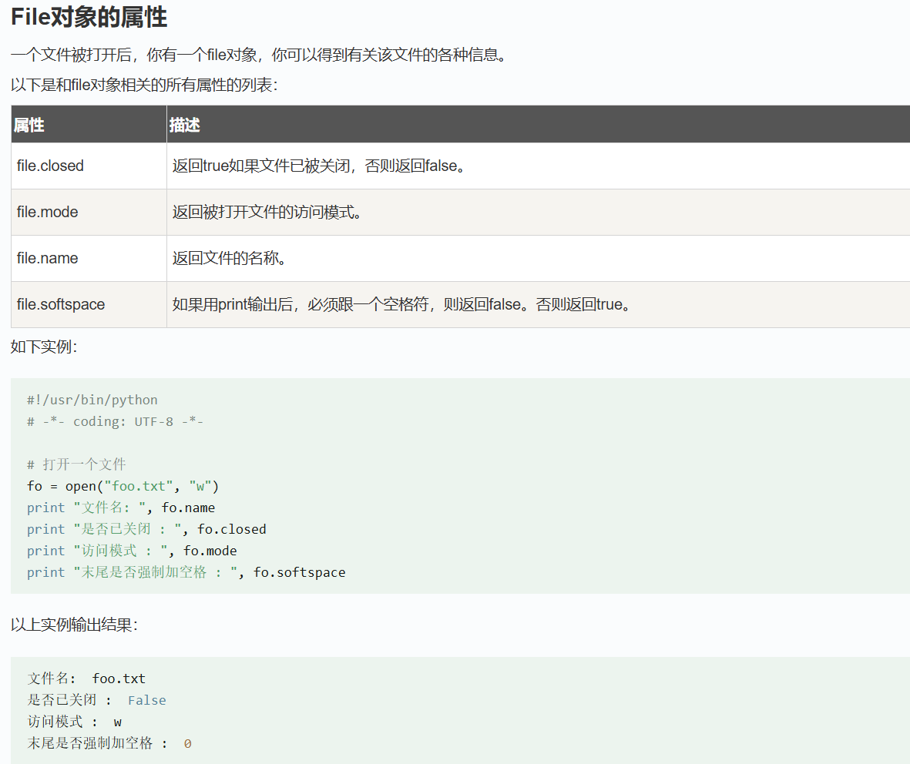|
|---|---|---|
注：在Python 3中，softspace属性已经被移除了。softspace是Python 2中用于控制print语句行为的属性，但在Python 3中不再存在。
#### File(文件) 方法
open() 方法
   1. 用于打开一个文件，并返回文件对象，在对文件进行处理过程都需要使用到这个函数，如果该文件无法被打开，会抛出 OSError。
   1. 使用 open() 方法一定要保证关闭文件对象，即调用 close() 方法。
   ```
   open(file, mode='r')
   open(file, mode='r', buffering=-1, encoding=None, errors=None, newline=None, closefd=True, opener=None)
   file: 必需，文件路径（相对或者绝对路径）。
   mode: 可选，文件打开模式
   buffering: 设置缓冲
   encoding: 一般使用utf8
   errors: 报错级别
   newline: 区分换行符
   closefd: 传入的file参数类型
   opener: 设置自定义开启器，开启器的返回值必须是一个打开的文件描述符。
   ```
|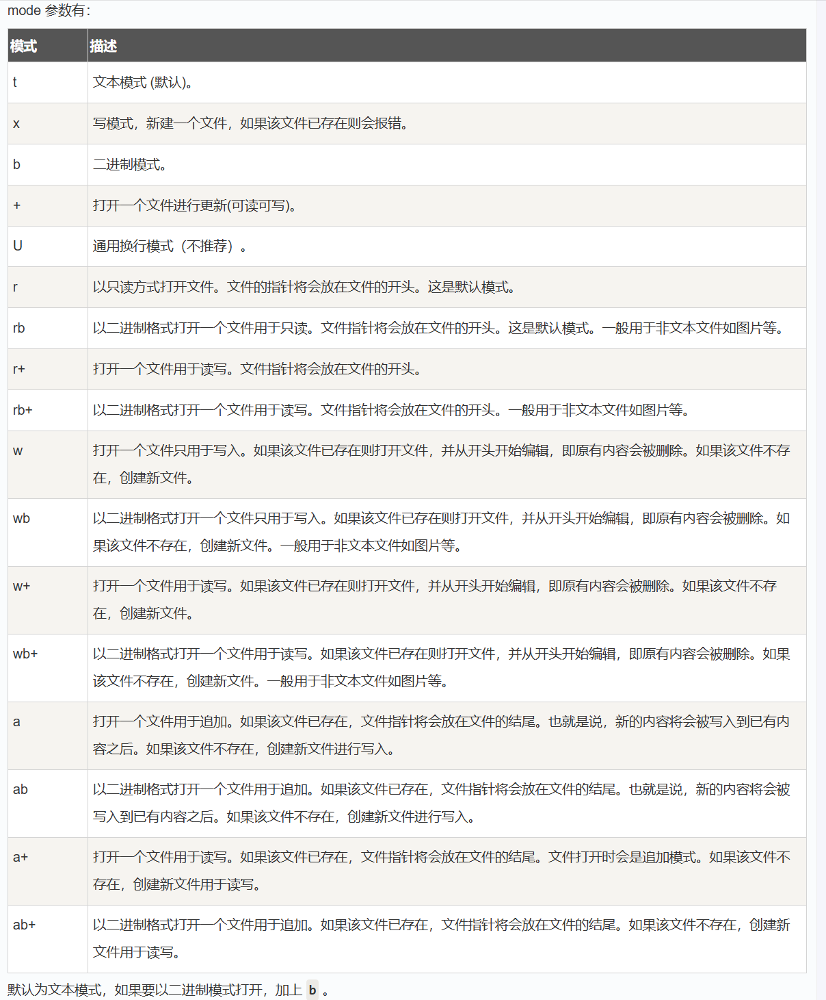|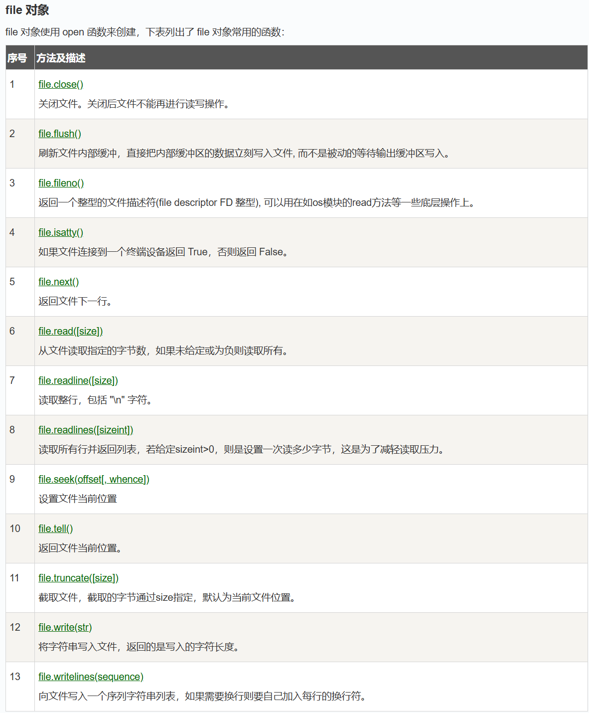|
|---|---|
#### os文件/目录方法
见 https://www.runoob.com/python/os-file-methods.html