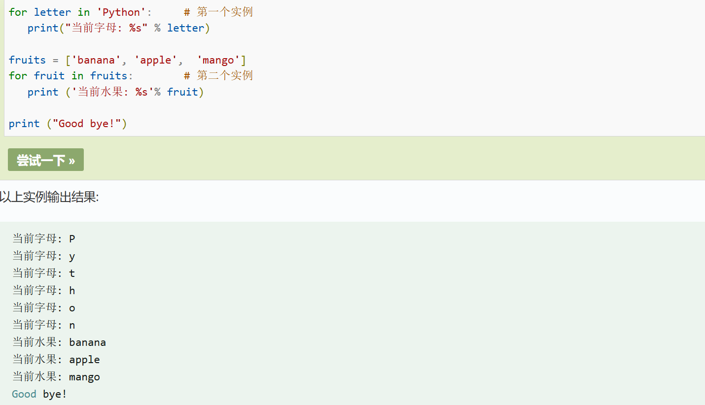
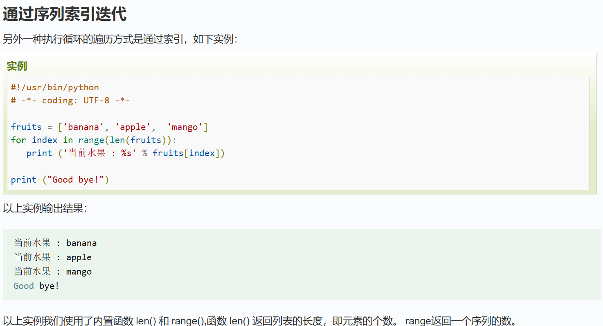
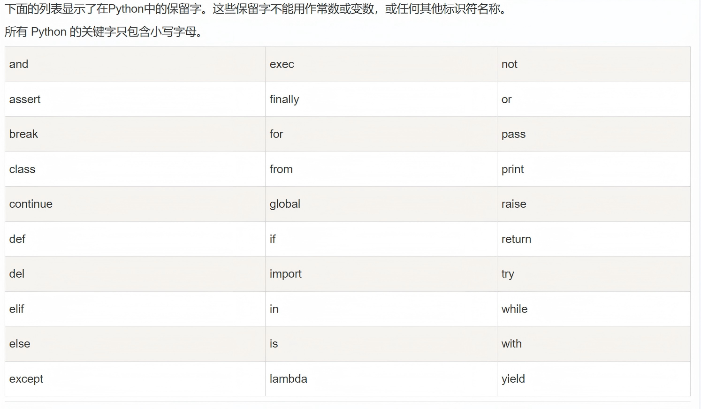
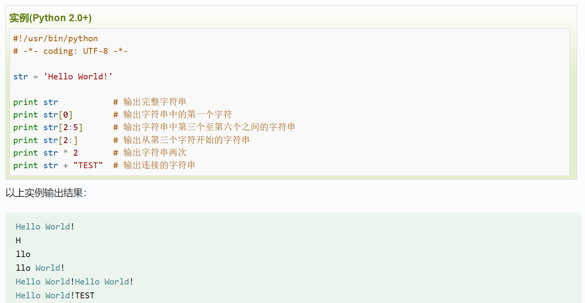
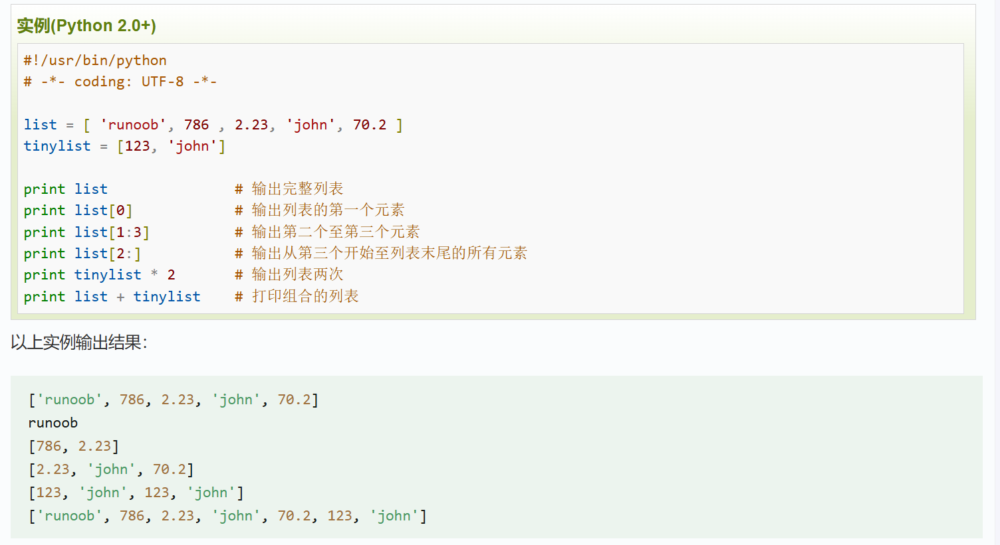
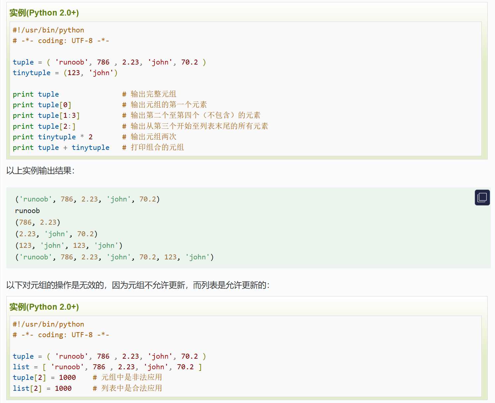
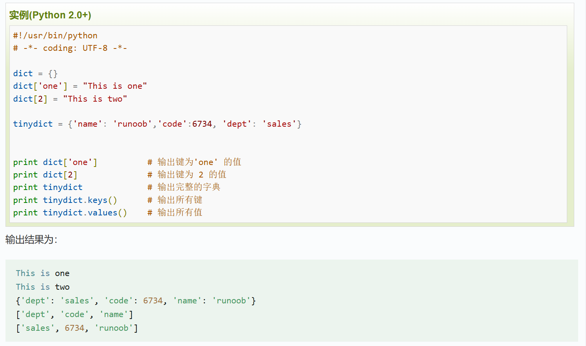
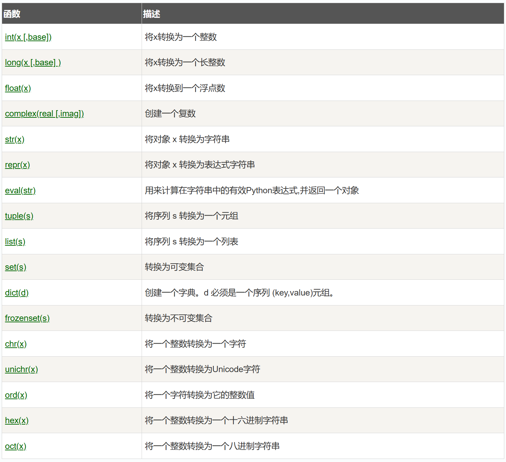
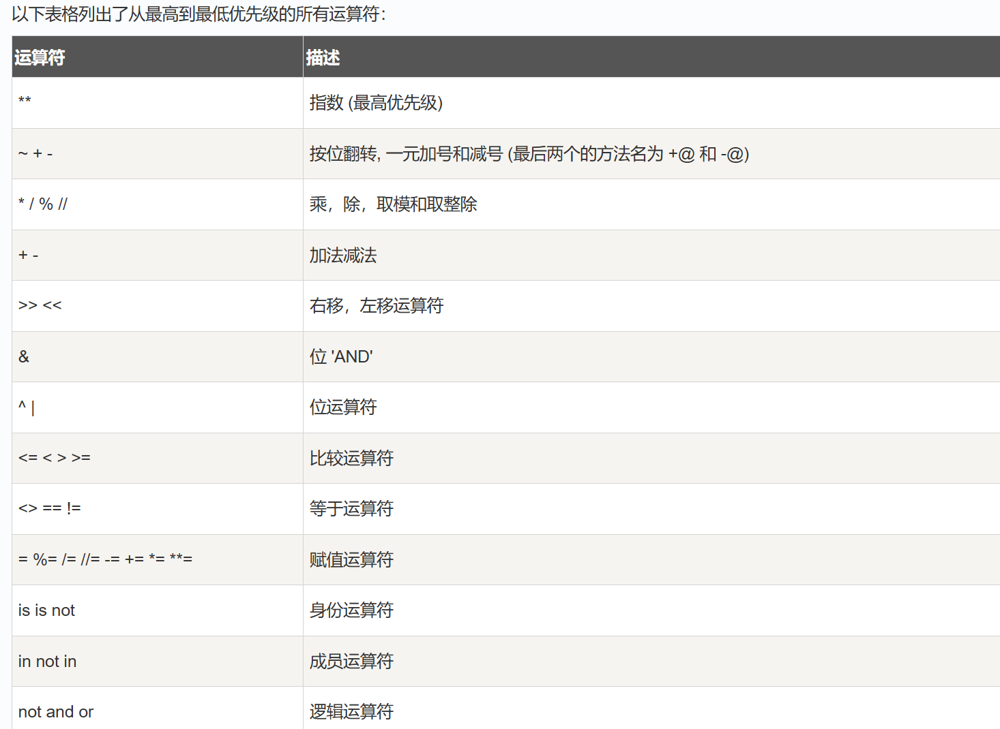

# python学习
教程：https://www.runoob.com/python/python-tutorial.html
## 基础语句
##### 输出 
> print("hello world!")
> #输出变量x的值
> print(x)
##### 等待用户输入
> raw_input("按下 enter 键退出，其他任意键显示...\n")
##### 变量定义赋值
> 变量名 = 变量值 
##### 条件语句
```
 if 判断条件1:
    执行语句1……
elif 判断条件2:
    执行语句2……
elif 判断条件3:
    执行语句3……
else:
    执行语句4……
```
python 并不支持 switch 语句,有多个条件时可使用括号来区分判断的先后顺序
##### 循环语句
###### while
```
while 判断条件：
    执行语句   #与该句缩进字符相同的语句均为while满足执行条件时会运行的语句

# while...else...  在循环条件为 false 时执行 else 语句块
while 判断条件：
    执行语句
else :
    执行语句
```
###### for
```
for iterating_var in sequence:
   执行语句

#for...else...  else中的语句会在循环正常执行完（即 for 不是通过 break 跳出而中断的）的情况下执行
for ... :
   执行语句
else  ：
   执行语句
```
实例：

###### 循环嵌套
注意缩进，同一级循环的缩进格式要相同
###### break 、 continue 和pass
break 来跳出循环，continue 用于跳过该次循环，pass 是空语句，是为了保持程序结构的完整性。
pass 不做任何事情，一般用做占位语句，不影响输出结果。

## 基础语法
1. 以下划线开头的标识符是有特殊意义的。以单下划线开头 _foo 的代表不能直接访问的类属性，需通过类提供的接口进行访问，不能用 from xxx import * 而导入。
1. 以双下划线开头的 __foo 代表类的私有成员，以双下划线开头和结尾的 __foo__ 代表 Python 里特殊方法专用的标识，如 __init__() 代表类的构造函数。
1. Python 可以同一行显示多条语句，方法是用分号 ; 分开，如：
   > print ('hello');print ('runoob');
1. python保留字符
   
1. 注意所有代码块语句必须包含相同的缩进空白数量
1. 以新行作为语句的结束符，但可以使用斜杠（ \）将一行的语句分为多行显示。语句中包含 [], {} 或 () 括号则不需要使用多行连接符。
1. 单行注释用#开头，多行注释使用三个单引号 ''' 或三个双引号 """
1. 引号( ' )、双引号( " )、三引号( ''' 或 """ ) 表示字符串。三引号可以由多行组成，编写多行文本的快捷语法，常用于文档字符串，在文件的特定地点，被当做注释（头尾引号各自单独一行，把要注释的内容夹在中间）。
   > paragraph = """这是一个段落。
   > 包含了多个语句"""

## 数据类型
##### Numbers（数字）
* int（有符号整型）
* long（长整型，也可以代表八进制和十六进制）
* float（浮点型）
* complex（复数）
##### String（字符串）
 
##### List（列表）
列表可以完成大多数集合类的数据结构实现。它支持字符，数字，字符串甚至可以包含列表（即嵌套）。
 
##### Tuple（元组）
同List区别在于Tuple只读，不可修改
 
##### Dictionary（字典）
列表是有序的对象集合，字典是无序的对象集合。
字典当中的元素是通过键来存取的，而不是通过偏移存取。
字典由索引(key)和它对应的值value组成。
 

## 数据类型转换


## 运算符
#### 运算符分类
##### 算术运算符
> " +  "   
> " - " 
> " * " 
> " %  "
x**y：幂 - 返回x的y次幂
x//y:取整除 - 返回商的整数部分（向下取整）
##### 比较运算符
>" == "
" != " 
" >= " 
" <= "
" > "
" < "
##### 赋值运算符
> " = "
##### 位运算符
> " & "
> " | "
> " ^ "
> " ~ "
> " << " :左移动运算符：运算数的各二进位全部左移若干位，由 << 右边的数字指定了移动的位数，高位丢弃，低位补0。
> " >> " :右移动运算符：把">>"左边的运算数的各二进位全部右移若干位，>> 右边的数字指定了移动的位数
##### 逻辑运算符
> " x and y " :布尔"与" - 如果 x 为 False，x and y 返回 False，否则它返回 y 的计算值。0为False
> " x or y " :布尔"或" - 如果 x 是非 0，它返回 x 的计算值，否则它返回 y 的计算值。
> " not x " :布尔"非" - 如果 x 为 True，返回 False 。如果 x 为 False，它返回 True。
##### 成员运算符
> " x in y " :如果在指定的序列y中找到值x返回 True，否则返回 False。
> " x not in y " :
#### 运算符优先级
