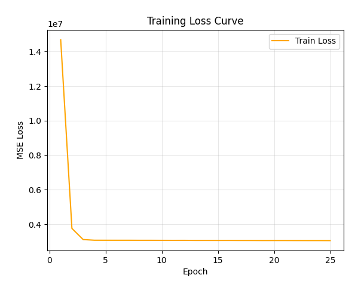
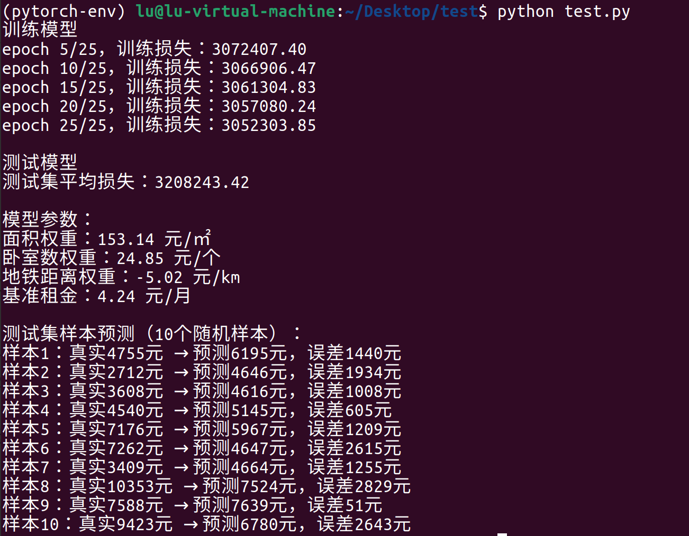

# DAY 9
教程:
https://zh-v2.d2l.ai/ 

### 完成任务
完成一个基于 Pytorch 的线性回归模型，能够对数据进行训练和预测。
代码见code/linear_model.py
### 模型功能
线性回归模型，根据所给数据集，选取特征对标签进行预测。如验证的数据集是利用房屋的面积、卧室数和地铁距离三个关键特征，对房屋租金进行预测，通过训练集学习特征与租金之间的线性关系，并在测试集上验证模型的预测效果。
### 模型构建思路
主要是基于教程PyTorch 高层 API 实现线性回归代码进行修改。
主要改进点：
1. 数据集
    1. 借由采用AI生成的房价数据集进行训练和测试，而不是教程里用d2l.synthetic_data造模拟数据。（生成代码见code/Data_generation_code.py）（数据集见code/house_rent_dataset.csv）
    2. 挑 3 个关键特征（面积、卧室数、地铁距离）和 1 个目标（租金），而非教程模型里的2个关键特征（不过其实主要就是把线性层改为 nn.Linear (3, 1)）
    3. 按 8:2 拆分数据。80% 训练集，20% 测试集检验效果。
    4. 因为 所以还要把数据转成 PyTorch 的张量格式
2. 数据加载器：直接复用教程的 load_array 函数，然后分别创建训练集和测试集的迭代器
3. 模型定义与初始化
    1. 因输入特征为 3 个，故将线性层改为 nn.Linear (3, 1)
    2. 保持参数初始化方式：权重正态分布、偏置初始化为 0
4. 损失函数和优化算法不变
5. 训练过程
   1. 训练轮数增加到25轮
   2. 每 5 轮打印一次损失,同时将损失结果可视化。
    
6. 测试过程
   1. 禁用梯度计算，节省资源
   2. 测试过程代码大致同训练过程
   3. 记录了所有预测值和真实值
7. 随机抽取测试集样本，展示具体预测效果和误差

结果：

