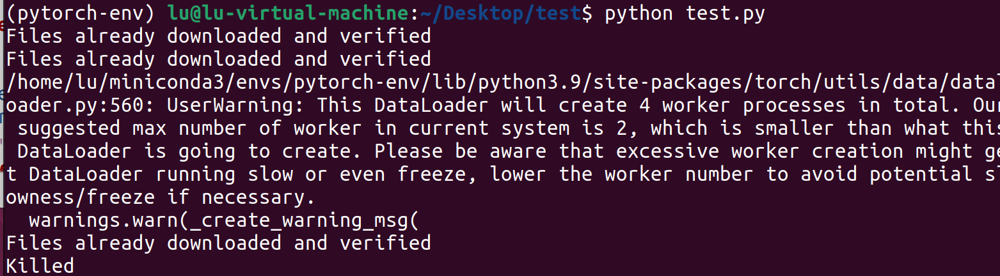

# DAY 11
论文：MDocAgent: A Multi-Modal Multi-Agent Framework for Document Understanding
https://github.com/aiming-lab/MDocAgent
教程:
https://zh-v2.d2l.ai/ 
https://docs.pytorch.org/vision/stable/index.html
### 完成任务
1. RAG相关文献阅读（笔记见MDoxAgent.md）
2. 计算机视觉基础学习（笔记见computer_vision.md）

### 遇到的问题
1. 在使用图像增广来训练模型时，允许教程代码出现pandas 与 numpy 版本严重不兼容而导致的错误。
 初步解决方法：重装。
    ```
    pip install pandas==1.5.3
    pip install torchvision==0.15.2 numpy==1.24.3
    ```
2. 在使用图像增广来训练模型时，虚拟机内存不足，killed
   
   一开始没注意是处理器数量问题，注释了图片显示，改了批大小batch_size 从256改成64，依旧不行，然后又看了一眼报错，发现是处理器问题，将虚拟机处理器数量改成4，然后开始漫长的训练过程。