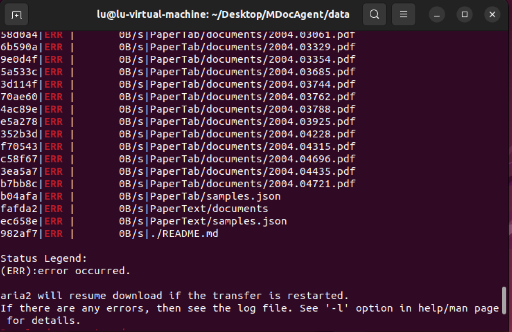

# DAY 13
### 完成任务
文献代码复现的环境配完了，下好了数据集

### 遇到的问题
要从Hugging Face上下载数据集，连接不上Hugging Face，各种报错，折腾了一下午，尝试了各种Hugging Face的下载方法，下不下来，然后又注册不了。晚上出去了一下，回来换了个代理，虽然还是注册不了，但是可以git clone下载了。太好了！以为要卡这一步了

```
git clone git@hf.co:datasets/Lillianwei/Mdocagent-dataset

```