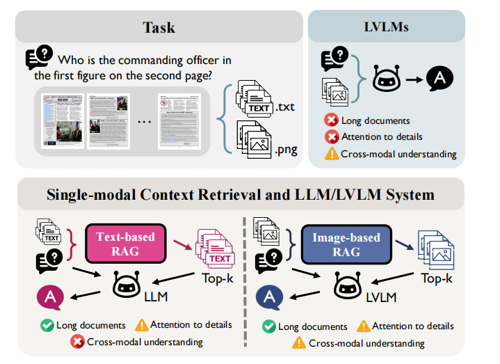
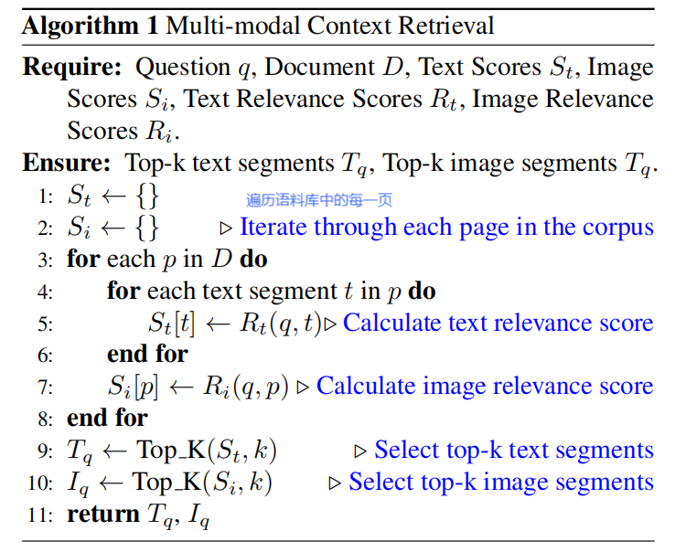
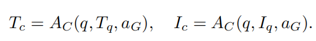
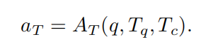
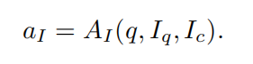
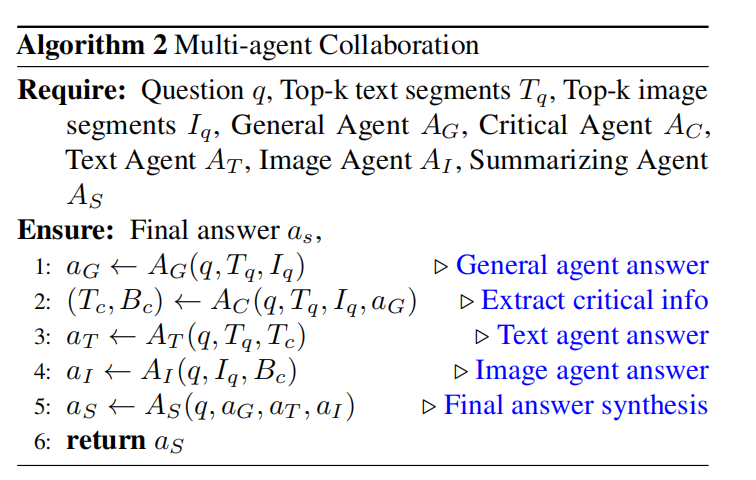
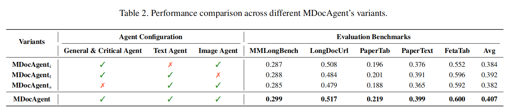
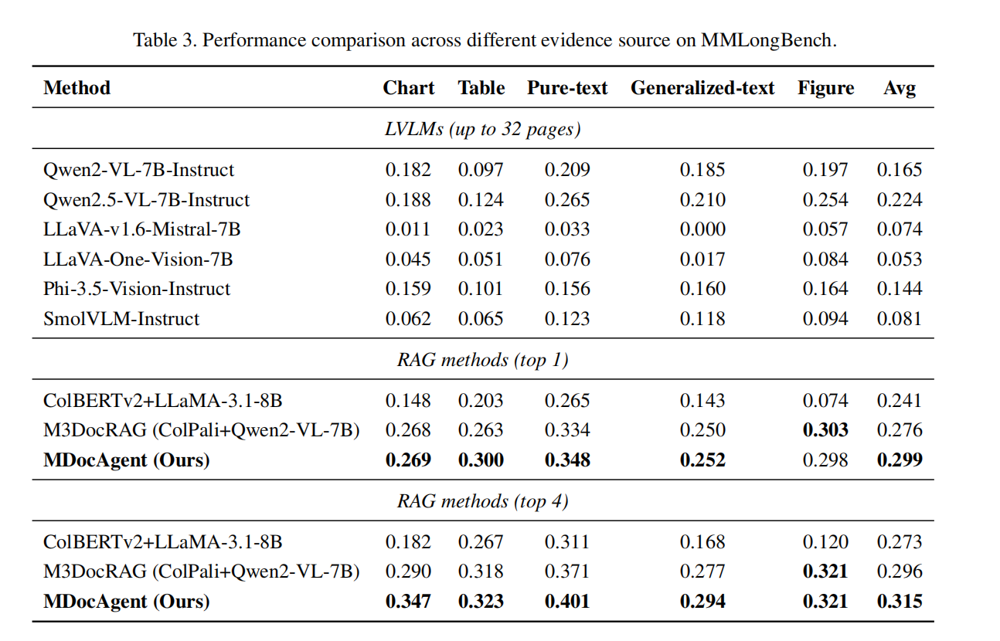
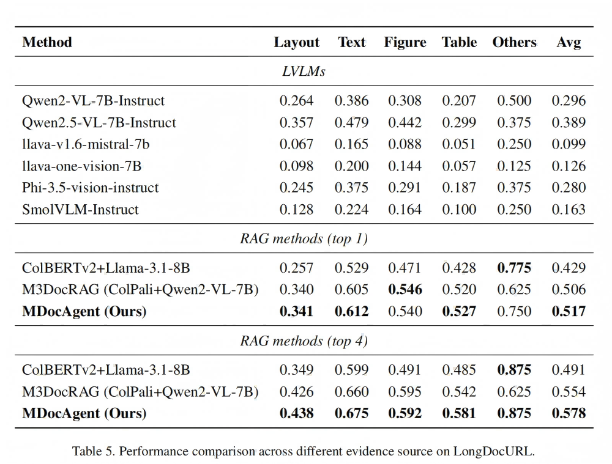
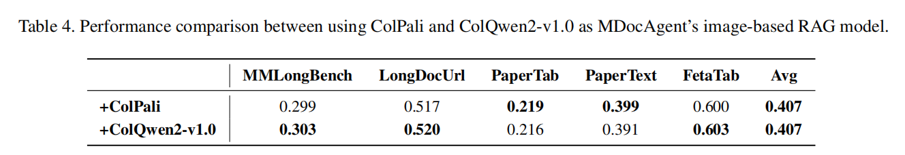

## MDocAgent: A Multi-Modal Multi-Agent Framework for Document Understanding
## MDocAgent:一种用于文档理解的多模态多智能体框架
### Introduction  
#### 研究背景
1. Answering questions based on reference documents(DocQA)在信息检索和自动化文档分析等方向有重要应用。
2. LLMs只能处理文本信息，LVLMs则常用于DocQA。LVLMs在处理视觉内容时表现优异，但在处理长文档时表现不佳，缺乏对细节的细致关注，同时在跨模态理解方面也存在局限性。单模态上下文检索可以处理长文档，但仍然面临详细分析或跨模态信息整合的问题。
   
3. 文档中通常存在大量信息。直接处理整个文档会消耗大量计算资源，导致模型难以识别最关键的信息。
4. RAG作为辅助工具被引入来提取长文档中关键字解决以上问题，但其仅在分别处理文本和视觉信息时有效，当同时处理两者时，会有些力不从心。
#### 挑战
DocQA中问题的多样性和涵盖信息的复杂性。
1. LVLMs则常用于DocQA。LVLMs在处理视觉内容时表现优异，但在处理长文档时表现不佳，缺乏对细节的细致关注，同时在跨模态理解方面也存在局限性。
2. 现有RAG缺乏跨模态信息整合能力。这种无法有效整合多模态信息的缺陷，制约了当前基于RAG的方法在复杂文档问答任务中的表现。
   
#### 框架概览
MDocAgent该框架融合了检索-生成（RAG）技术与协作式多智能体系统，通过专业智能体协同处理文本与图像信息。系统采用双线程RAG架构：文本RAG负责基础信息提取，图像RAG专注视觉内容分析。整个框架包含五大智能体：通用智能体负责多模态预处理，关键智能体精准识别核心信息，文本智能体进行文本解析，图像智能体执行模态内深度分析，最终由摘要智能体整合生成完整答案。
运作分为五个阶段：(1) 文档预处理：通过OCR提取文本，并将页面保存为图像。(2) 多模态上下文检索：基于文本和图像的RAG工具分别检索出前k个相关文本片段和图像页面。(3) 初始分析与关键信息提取：通用智能体生成初步响应，关键智能体提取核心信息并传递给专业智能体。(4) 专业智能体处理：文本和图像智能体根据关键信息，分别在其专业领域内分析检索到的上下文。(5) 答案综合：摘要智能体整合所有智能体的响应，生成最终答案。
    
MDocAgent框架概述：这是一个支持多模态交互的多智能体系统，其运作流程包含五个阶段：(1) 使用PDF工具处理文档以提取文本和图像。(2) 基于文本和图像的RAG检索系统会筛选出前k个相关片段和图像页面。(3) 通用智能体提供初步答案，而关键智能体则从两种模态中提取核心信息。(4) 专业智能体分别处理各自模态中的检索信息和关键信息，生成优化后的答案。(5) 总结智能体整合所有前期输出，最终生成完整答案。
### Related Work
1. **LVLMs in DocQA Tasks** : LVLMs能将图像中的文本转化为视觉表征，同时保留版式和视觉上下文。然而，这类模型仍面临输入规模限制和可能丢失细粒度文本细节等挑战，因此实现文本与视觉信息的有效整合，对DocVQA的精准性能至关重要
2. **Retrieval-Augmented Generation(RAG)** : 现有的针对LVLMs的图像RAG可以用以检索视觉相关，但因为检索的相互独立进行，无法有效整合和分析文本和图像信息。
3. **Multi-Agent Systems** : 多智能体系统可以通过配置专业智能体分工协作，共同完成单一模型难以应对的任务。然而在DocQA应用中，由于需要整合多种模态信息，系统面临独特挑战。单纯叠加文本与图像智能体的输出，往往难以捕捉二者间的微妙交互——这种交互正是准确理解文档的关键。

### MDocAgent(details)
5个阶段
#### 文档预处理
1. 目标：将文档语料库转换为适合文本与视觉分析的格式
2. 技术：采用光学字符识别（OCR）与PDF解析技术相结合的方式提取文本内容。这种双管齐下的方法确保了对不同文档格式和结构的稳健文本提取。
3. 该框架允许通过整合文本与视觉线索实现全面理解。预处理过程生成文档语料库的双重表征：文本表征由提取的文本片段构成，视觉表征则包含原始页面图像。
#### 多模态上下文检索
1. 目标：在同时兼顾文本和图像信息的基础上，从文档语料库中高效检索最相关的信息。
2. 技术：使用ColBERT进行文本检索，使用ColPali进行图像检索，独立获取基于输入问题的前k个相关文本段和图像页面。

#### 初始分析和关键提取
1. 目标：初步解读问题，并在检索到的上下文中精准定位关键信息。
2. 技术：The general agent AG作为多模态整合器，接收检索到的文本上下文Tq和视觉上下文Iq，并整合两种模态中的信息，对这些多模态输入进行处理，然后初步生成答案aG。
   The critical agent AC对接收问题q、检索到的上下文Tq和Iq，以及通用代理生成的初步答案aG这些输入进行细致分析，筛选出对准确回答问题至关重要的关键信息Tc和Ic。

    |||
    |-|-|
    |||
#### 专门代理处理
1. 目标：通过运用前一阶段提取的关键信息指导的专业智能体进行分析。
2. 技术：The text agentAT接收检索到的文本片段Tq和关键文本信息Tc作为输入，在其模态里对提供的文本片段进行深度分析，最终生成基于文本的详细答案aT。
   The image agentAI接收检索到的图像Iq和关键视觉信息Ic，针对关键视觉信息Ic所标注的区域或特征进行图像处理，从视觉内容中提取有价值的信息，最终生成的视觉化AI答案aI
#### 答案综合
1. 目标：整合前序各阶段的多元输出，将初始的多模态理解与专业智能体分析相结合，生成全面精准的答案。
2. 技术：The summarizing agent AS分别接收前面agent生成的答案aG、aT和aI，分析各智能体的答案，识别共性特征、差异点及互补洞见，并考量各智能体提供的佐证。通过化解智能体间的潜在冲突或分歧，整合各自优势，构建出最终答案aS。
    

### Experiment
实验验证
1. 相较于现有基于RAG的方法，MDocAgent能否有效提升文档理解准确率？
2. 框架中的每个智能体是否发挥着关键作用？
3. 该方法如何增强模型对文档的理解能力？
#### 实验设置
1. 实施细节：
   1.  text agent： Llama-3.1-8B-Instruct 
   2.  other four agents： Qwen2-VL-7B-Instruct 
   3.  the text and image retrievers：ColBERTv2  and ColPali 
   4.  每个示例提取1个或4个最高分片段作为输入上下文
2. 数据集
    这些评估数据集涵盖多种场景，包括开放域与封闭域、文本与视觉、长文档与短文档，确保评估的公平性和完整性。
    MMLongBench
    LongDocUrl
    PaperTab
    PaperText
    FetaTab
3. 评估指标
在所有基准测试中，采用GPT-4o作为评估模型，参照Deng等人和Ma等人的方法，通过比较模型输出与参考答案的一致性，生成二元判定结果（正确/错误）。
#### 主要研究结果
结果：MDocAgent Outperforms All the Comparison Methods
and Other LVLMs.
    
1. 在top-1检索方式下， MDocAgent 平均提高了12.1%，比当前最新提出的表现最亮眼的 M3DocRAG 还高。表明 MDocAgent 在应对信息过载、细节精准捕捉和跨模态理解等核心挑战方面，比现有方法更具优势。
    1. 在FetaTab数据集上， MDocAgent 获得0.600的分数，超越 M3DocRAG 21.0%。
    2. 在 PaperText 上， MDocAgent 得分为0.399，超越 M3DocRAG 16.7%。
    3. 与最佳 LVLM（Qwen2.5-VL-7B）和基于文本-RAG（ColBERTv2+Llama-3.1-8B）的基准模型相比，MDocAgent 在所有测试中平均提升51.9%和23.7%。
2. 在top-4检索方式下， MDocAgent在所有基准测试中仍表现最佳，并进一步扩大了领先优势。体现其有效整合多个检索项的能力。
    1. 平均超越Qwen2.5-VL-7B 73.5%，展示了其有效利用额外上下文信息的能力。
    2. 平均超越M3DocRAG 10.9%，同时比ColBERTv2+Llama-3.1- 8B提升了6.9%。
    3. 相比之下，M3DocRAG在前4次检索中表现下降，表明在整合多个检索项方面存在局限性。   
> top-1 retrieval:top-1检索方式，指信息检索系统中返回最相关单个结果的检索模式。
> top-4 retrieval:前4项检索方式，指在信息检索过程中返回相关性最高的前4个结果，用于评估检索系统的性能表现。
> Ablation Studies： 消融研究，用于分析模型中各组件对性能的影响
#### 定量分析
1. 消融实验

通过数据比对，可以看出每个智能体的重要性，去除任何一个智能体，都会导致性能的显著下降。
2. 细粒度性能分析

|||
|--|--|
主要看基于MMLongBench数据集的结果。通过数据比对，可以看到
   1. MDocAgent在所有证据模态类型中均优于所有 LVLM 基准模型。
   2. 在top-1检索方式下，MDocAgent虽然在Figure类别中表现比M3DocRAG略差，但在Chart、Table和Text类别中展现出强劲实力，这充分体现了其处理文本与视觉信息的卓越能力。
   3. 在top-4检索方式下，MDocAgent在所有类别中均实现性能提升，尤其在Figure类别中表现突出，彰显了其有效处理多样化信息源的强项。
3. 

