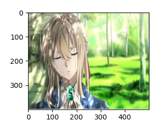
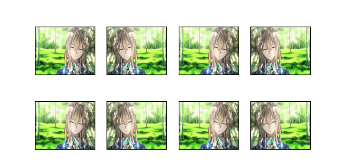
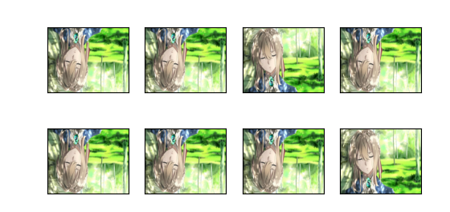
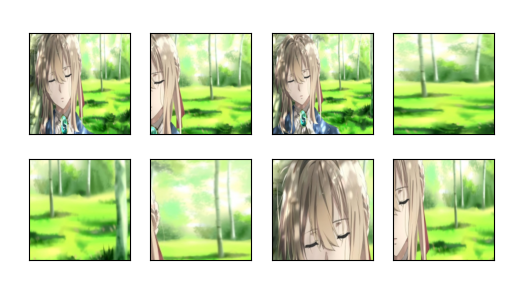
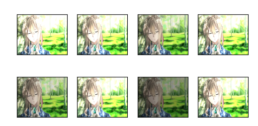
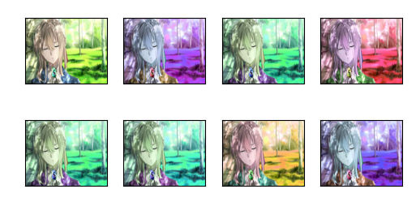
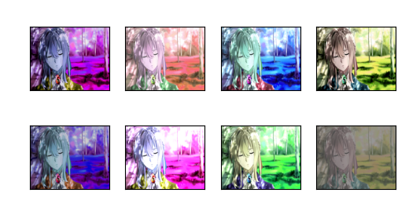
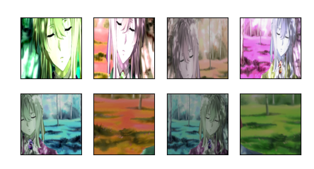
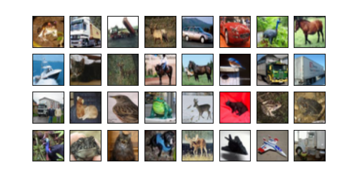

## 图像增广
图像增广在对训练图像进行一系列的随机变化之后，生成相似但不同的训练样本，从而扩大了训练集的规模。 此外，随机改变训练样本可以减少模型对某些属性的依赖，从而提高模型的泛化能力。
#### 基本图像增广方法
```
import torch
import torchvision
from torch import nn
from d2l import torch as d2l

d2l.set_figsize()                       # 设置绘图的尺寸（d2l封装的matplotlib配置）
img = d2l.Image.open('./people.jpg')    # 打开图片（d2l.Image实际调用PIL库的Image）
d2l.plt.imshow(img)                     # 用matplotlib显示图像（d2l.plt即matplotlib.pyplot的别名）
d2l.plt.show()                          # 因为虚拟机图形显示配置问题，要显示调用才能显示图像

def apply(img, aug, num_rows=2, num_cols=4, scale=1.5):
    # 对原始图像img应用`aug`变换，生成 num_rows*num_cols 张增强后的图像,图像显示的缩放比例为scale
    Y = [aug(img) for _ in range(num_rows * num_cols)]
    # 用d2l的工具函数显示所有增强图像，排列成 num_rows 行、num_cols 列
    d2l.show_images(Y, num_rows, num_cols, scale=scale)

# ---------------------- 翻转和裁剪 ----------------------
# 使用transforms模块来创建RandomFlipLeftRight实例，这样就各有50%的几率使图像向左或向右翻转。
apply(img, torchvision.transforms.RandomHorizontalFlip()) 
d2l.plt.show()
# RandomFlipTopBottom实例，使图像各有50%的几率向上或向下翻转。
apply(img, torchvision.transforms.RandomVerticalFlip())
d2l.plt.show()

# 随机裁剪一个面积为原始面积10%到100%的区域，该区域的宽高比从0.5～2之间随机取值。 然后，区域的宽度和高度都被缩放到200像素。
shape_aug = torchvision.transforms.RandomResizedCrop(
    (200, 200),         # 裁剪后图像的目标尺寸（高200，宽200）
    scale=(0.1, 1),     # 裁剪区域面积占原始图像面积的比例范围（10%~100%）
    ratio=(0.5, 2)      # 裁剪区域宽高比的范围（0.5~2，即可以是窄长或宽扁）
)
apply(img, shape_aug)
d2l.plt.show()


# ---------------------- 改变颜色 ----------------------
# 随机更改图像的亮度，随机值为原始图像的50%（1 - 0.5）到150%（1 + 0.5）之间。
apply(img, torchvision.transforms.ColorJitter(
    brightness=0.5, contrast=0, saturation=0, hue=0))
d2l.plt.show()

# 随机调整色调：色调偏移范围为-0.5~0.5（hue的取值范围通常为[-0.5, 0.5]）
apply(img, torchvision.transforms.ColorJitter(
    brightness=0, contrast=0, saturation=0, hue=0.5))
d2l.plt.show()

# RandomColorJitter实例，同时随机更改图像的亮度（brightness）、对比度（contrast）、饱和度（saturation）和色调（hue）。
color_aug = torchvision.transforms.ColorJitter(
    brightness=0.5, contrast=0.5, saturation=0.5, hue=0.5)
apply(img, color_aug)
d2l.plt.show()


# Compose实例来综合上面定义的不同的图像增广方法，并将它们应用到每个图像。
augs = torchvision.transforms.Compose([
    torchvision.transforms.RandomHorizontalFlip(), color_aug, shape_aug])
apply(img, augs)
d2l.plt.show()
```
（里面提到的实例都是torchvision.transforms模块内置的图像变换类，还是得回归torchvision官方的教程看看嘞，明天安排上）
|||
|---|---|
|原图|左右翻转|
|||
|上下翻转|裁剪|
|||
|调亮度|调色调|
|||
|亮度、对比度、饱和度和色调|综合|

#### 使用图像增广来训练模型
```
import torch
import torchvision
from torch import nn
from d2l import torch as d2l

# 下载并加载CIFAR-10训练集
all_images = torchvision.datasets.CIFAR10(train=True, root="../data", download=True)
# 显示前32张图片，排列为4行8列，缩放比例0.8
d2l.show_images([all_images[i][0] for i in range(32)], 4, 8, scale=0.8)
d2l.plt.show()              ## 因为虚拟机图形显示配置问题，要显示调用才能显示图像
```

```

```


